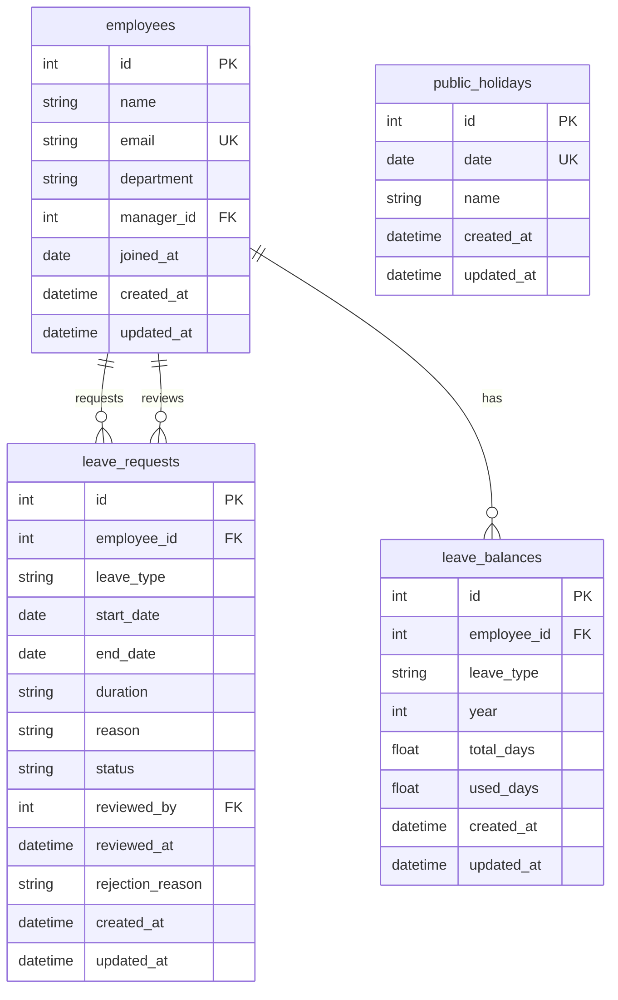

# Design Document — Leave Management System

**Author:** Gavin Moh
**Date:** 2026-05-07

## 1. API Design

**Base path:** `/api/v1`

**Authentication (conceptual only):** All endpoints require an `Authorization` header. The token is the employee's ID, used to identify the caller. In production this would be a proper authentication mechanism (session, token, etc.) validated by middleware — here it's a placeholder to illustrate the concept.

A missing or malformed `Authorization` header returns `401 Unauthorized`. This applies to every endpoint below and is omitted from individual status tables for brevity.

```
Authorization: Bearer {employee_id}
```

---

### 1.1 List Employees

```
GET /api/v1/employees
Authorization: Bearer {employee_id}
```

**Query Parameters**

| Param | Type | Default | Notes |
|-------|------|---------|-------|
| `page` | int | 1 | >= 1 |
| `page_size` | int | 20 | 1–100 |

Returns the caller's direct reports (employees whose `manager_id` matches the caller's ID). If the caller has no direct reports, returns an empty list — not an error.

**Response** `200 OK`

```json
{
  "items": [
    {
      "id": 1,
      "name": "Alice Manager",
      "email": "alice@company.com",
      "department": "Engineering",
      "manager_id": null
    }
  ],
  "total": 1,
  "page": 1,
  "page_size": 20
}
```

| Status | Meaning |
|--------|---------|
| 200 | Success |
| 401 | Missing or malformed `Authorization` header |

---

### 1.2 Get Employee with Balances

```
GET /api/v1/employees/{employee_id}
Authorization: Bearer {employee_id}
```

**Response** `200 OK`

```json
{
  "employee": {
    "id": 2,
    "name": "Bob Engineer",
    "email": "bob@company.com",
    "department": "Engineering",
    "manager_id": 1
  },
  "leave_balances": [
    {
      "leave_type": "annual",
      "year": 2026,
      "total_days": 14.0,
      "used_days": 0.0,
      "remaining_days": 14.0
    }
  ]
}
```

| Status | Meaning |
|--------|---------|
| 200 | Success |
| 401 | Missing or malformed `Authorization` header |
| 404 | Employee not found |

---

### 1.3 Create Leave Request

```
POST /api/v1/leave-requests
Authorization: Bearer {employee_id}
```

The `employee_id` is derived from the auth token — the caller is always the requester.

**Request Body**

```json
{
  "leave_type": "annual",
  "start_date": "2026-05-10",
  "end_date": "2026-05-12",
  "duration": "full",
  "reason": "Family vacation"
}
```

| Field | Type | Required | Notes |
|-------|------|----------|-------|
| `leave_type` | enum | yes | `annual`, `sick`, `personal`, `maternity`, `paternity`, `unpaid` |
| `start_date` | date | yes | Must be >= today; must be a weekday if `duration` is `first_half` or `second_half` |
| `end_date` | date | yes | Must be >= start_date; must equal `start_date` if `duration` is `first_half` or `second_half` |
| `duration` | enum | yes | `full`, `first_half`, `second_half`. Half-day durations are single-day only — rejects multi-day requests. |
| `reason` | string | no | |

Dates are validated against weekends and public holidays. If every day between `start_date` and `end_date` is a weekend or holiday, the request is rejected — there are no working days to deduct.

**Response** `201 Created`

```json
{
  "id": 1,
  "employee_id": 2,
  "leave_type": "annual",
  "start_date": "2026-05-10",
  "end_date": "2026-05-12",
  "duration": "full",
  "reason": "Family vacation",
  "status": "pending",
  "reviewed_by": null,
  "reviewed_at": null,
  "rejection_reason": null
}
```

| Status | Meaning |
|--------|---------|
| 201 | Created |
| 401 | Missing or malformed `Authorization` header |
| 404 | Employee not found |
| 422 | Validation error (overlap, insufficient balance, invalid dates) |

---

### 1.4 List Leave Requests (Filtered + Paginated)

```
GET /api/v1/leave-requests
Authorization: Bearer {employee_id}
```

**Query Parameters**

| Param | Type | Default | Notes |
|-------|------|---------|-------|
| `employee_id` | int | none | Optional filter — scope to a specific direct report's requests. If omitted, returns the caller's own requests and all direct reports' requests. |
| `status` | enum | none | `pending`, `approved`, `rejected`, `cancelled` |
| `leave_type` | enum | none | Filter by type |
| `from_date` | date | none | Start of interval overlap filter. A request matches if `start_date <= to_date AND end_date >= from_date`. Both params together define the filter range; neither works alone as a simple bound. |
| `to_date` | date | none | End of interval overlap filter. See `from_date` — together they select requests that have any working day within `[from_date, to_date]`. |
| `page` | int | 1 | >= 1 |
| `page_size` | int | 20 | 1–100 |

Results are always scoped to the caller's own requests and their direct reports' requests. Passing `employee_id` filters to a specific direct report. The manager relationship is determined by `manager_id` on the employee record.

**Response** `200 OK`

```json
{
  "items": [
    {
      "id": 1,
      "employee_id": 2,
      "leave_type": "annual",
      "start_date": "2026-05-10",
      "end_date": "2026-05-12",
      "duration": "full",
      "reason": "Family vacation",
      "status": "pending",
      "reviewed_by": null,
      "reviewed_at": null,
      "rejection_reason": null
    }
  ],
  "total": 1,
  "page": 1,
  "page_size": 20
}
```

| Status | Meaning |
|--------|---------|
| 200 | Success (empty list if no results) |
| 401 | Missing or malformed `Authorization` header |
| 422 | Invalid query param |

---

### 1.5 Get Single Leave Request

```
GET /api/v1/leave-requests/{leave_request_id}
Authorization: Bearer {employee_id}
```

**Response** `200 OK`

```json
{
  "id": 1,
  "employee_id": 2,
  "leave_type": "annual",
  "start_date": "2026-05-10",
  "end_date": "2026-05-12",
  "duration": "full",
  "reason": "Family vacation",
  "status": "pending",
  "reviewed_by": null,
  "reviewed_at": null,
  "rejection_reason": null
}
```

| Status | Meaning |
|--------|---------|
| 200 | Success |
| 401 | Missing or malformed `Authorization` header |
| 404 | Leave request not found |

---

### 1.6 Review Leave Request (Approve or Reject)

```
POST /api/v1/leave-requests/{leave_request_id}/review
Authorization: Bearer {employee_id}
```

The `reviewed_by` is derived from the auth token — the caller is the reviewer.

**Request Body**

```json
{
  "decision": "rejected",
  "rejection_reason": "Team needs coverage during that sprint"
}
```

| Field | Type | Required | Notes |
|-------|------|----------|-------|
| `decision` | enum | yes | `approved` or `rejected` |
| `rejection_reason` | string | no | Strongly recommended when decision is `rejected` |

**Response** `200 OK`

```json
{
  "id": 1,
  "employee_id": 2,
  "leave_type": "annual",
  "start_date": "2026-05-10",
  "end_date": "2026-05-12",
  "duration": "full",
  "reason": "Family vacation",
  "status": "rejected",
  "reviewed_by": 1,
  "reviewed_at": "2026-05-05T10:30:00",
  "rejection_reason": "Team needs coverage during that sprint"
}
```

| Status | Meaning |
|--------|---------|
| 200 | Review processed |
| 401 | Missing or malformed `Authorization` header |
| 404 | Leave request not found |
| 422 | Validation error (not pending, self-review, not the direct manager) |

---

### 1.7 Cancel Leave Request

```
POST /api/v1/leave-requests/{leave_request_id}/cancel
Authorization: Bearer {employee_id}
```

The caller's identity comes from the auth token. Only the owner can cancel. A leave request cannot be cancelled if its `start_date` is in the past (i.e., the leave has already begun or ended).

No request body. No query parameters.

**Response** `200 OK`

```json
{
  "id": 1,
  "employee_id": 2,
  "leave_type": "annual",
  "start_date": "2026-05-10",
  "end_date": "2026-05-12",
  "duration": "full",
  "reason": "Family vacation",
  "status": "cancelled",
  "reviewed_by": 1,
  "reviewed_at": "2026-05-05T10:30:00",
  "rejection_reason": null
}
```

| Status | Meaning |
|--------|---------|
| 200 | Cancelled |
| 401 | Missing or malformed `Authorization` header |
| 403 | Caller is not the owner |
| 404 | Leave request not found |
| 422 | Validation error (already cancelled, cannot cancel rejected, start_date in the past) |

---

### 1.8 Get Leave Balances

```
GET /api/v1/leave-balances/{employee_id}
Authorization: Bearer {employee_id}
```

**Query Parameters**

| Param | Type | Default | Notes |
|-------|------|---------|-------|
| `year` | int | current year | Filter by year |

**Response** `200 OK`

```json
[
  {
    "leave_type": "annual",
    "year": 2026,
    "total_days": 14.0,
    "used_days": 5.0,
    "remaining_days": 9.0
  }
]
```

| Status | Meaning |
|--------|---------|
| 200 | Success |
| 401 | Missing or malformed `Authorization` header |
| 404 | Employee not found |

---

### 1.9 Manage Public Holidays

Public holidays are excluded from working-day counts when computing leave duration. Only implied managers (employees with `manager_id IS NULL`) can create, update, or delete holidays; any authenticated employee can view them.

#### List Holidays

```
GET /api/v1/holidays
Authorization: Bearer {employee_id}
```

**Query Parameters**

| Param | Type | Default | Notes |
|-------|------|---------|-------|
| `year` | int | none | Filter by year. If omitted, returns all holidays. |
| `page` | int | 1 | >= 1 |
| `page_size` | int | 50 | 1–100 |

**Response** `200 OK`

```json
{
  "items": [
    {
      "id": 1,
      "date": "2026-01-01",
      "name": "New Year's Day"
    }
  ],
  "total": 1,
  "page": 1,
  "page_size": 50
}
```

| Status | Meaning |
|--------|---------|
| 200 | Success (empty list if no results) |
| 401 | Missing or malformed `Authorization` header |

#### Create Holiday

```
POST /api/v1/holidays
Authorization: Bearer {employee_id}
```

**Request Body**

```json
{
  "date": "2026-01-01",
  "name": "New Year's Day"
}
```

| Field | Type | Required | Notes |
|-------|------|----------|-------|
| `date` | date | yes | Must not duplicate an existing holiday date |
| `name` | string | yes | Human-readable name |

**Response** `201 Created`

```json
{
  "id": 1,
  "date": "2026-01-01",
  "name": "New Year's Day"
}
```

| Status | Meaning |
|--------|---------|
| 201 | Created |
| 401 | Missing or malformed `Authorization` header |
| 422 | Validation error (duplicate date, missing name) |

#### Update Holiday

```
PUT /api/v1/holidays/{holiday_id}
Authorization: Bearer {employee_id}
```

**Request Body**

```json
{
  "date": "2026-01-01",
  "name": "New Year's Day (Updated)"
}
```

| Field | Type | Required | Notes |
|-------|------|----------|-------|
| `date` | date | yes | Must not duplicate an existing holiday date (excluding self) |
| `name` | string | yes | Human-readable name |

**Response** `200 OK`

```json
{
  "id": 1,
  "date": "2026-01-01",
  "name": "New Year's Day (Updated)"
}
```

| Status | Meaning |
|--------|---------|
| 200 | Updated |
| 401 | Missing or malformed `Authorization` header |
| 404 | Holiday not found |
| 422 | Validation error (duplicate date) |

#### Delete Holiday

```
DELETE /api/v1/holidays/{holiday_id}
Authorization: Bearer {employee_id}
```

**Response** `204 No Content`

| Status | Meaning |
|--------|---------|
| 204 | Deleted |
| 401 | Missing or malformed `Authorization` header |
| 404 | Holiday not found |

---

### Summary Table

| # | Method | Path | Auth determines | Service |
|---|--------|------|-----------------|---------|
| 1 | `GET` | `/api/v1/employees` | — | `list_employees` |
| 2 | `GET` | `/api/v1/employees/{id}` | — | `get_employee` |
| 3 | `POST` | `/api/v1/leave-requests` | requester (`employee_id`) | `create_leave_request` |
| 4 | `GET` | `/api/v1/leave-requests` | scoped to self + direct reports | `list_leave_requests` |
| 5 | `GET` | `/api/v1/leave-requests/{id}` | — | `get_leave_request` |
| 6 | `POST` | `/api/v1/leave-requests/{id}/review` | reviewer (`reviewed_by`) | `review_leave_request` |
| 7 | `POST` | `/api/v1/leave-requests/{id}/cancel` | owner | `cancel_leave_request` |
| 8 | `GET` | `/api/v1/leave-balances/{id}` | — | `get_leave_balances` |
| 9 | `GET` | `/api/v1/holidays` | — | `list_holidays` |
| 10 | `POST` | `/api/v1/holidays` | — | `create_holiday` |
| 11 | `PUT` | `/api/v1/holidays/{id}` | — | `update_holiday` |
| 12 | `DELETE` | `/api/v1/holidays/{id}` | — | `delete_holiday` |

### Design Notes

- **Auth is conceptual.** The `Authorization: Bearer {employee_id}` header is parsed to extract the caller's identity. In production this would be a proper authentication mechanism (session, token, etc.) validated by middleware. For this implementation, the token value is simply the raw employee ID string, parsed via a FastAPI dependency.
- **No identity leaked via params or body.** `employee_id` never appears in request bodies or query params where the caller's own identity is needed — it's always extracted from the auth header.
- **`rejection_reason`** is added to the review endpoint and the `LeaveRequest` model to give managers a place to explain rejections.
- **`employee_id` as a query param on `GET /leave-requests`** is a *filter* for viewing team requests, not an identity claim. Results are scoped to the caller's own requests and their direct reports' requests.
- **`review_leave_request`** is the service backing the review endpoint. It was renamed from `approve_leave_request` because the same service handles both approvals and rejections — `reviewed_by` and `reviewed_at` reflect this neutrality.
- **Public holidays** are a first-class resource with full CRUD. The working-day counting function consults the `public_holidays` table to exclude holidays from leave deductions, in addition to skipping weekends. Holiday management is restricted to managers.


## 2. Data Model

### 2.1 Entity-Relationship Diagram



### 2.2 Tables

#### `employees`

| Column | Type | Constraints | Notes |
|--------|------|-------------|-------|
| `id` | INTEGER | PK, INDEX | |
| `name` | VARCHAR | NOT NULL | |
| `email` | VARCHAR | UNIQUE, NOT NULL, INDEX | |
| `department` | VARCHAR | NOT NULL | |
| `manager_id` | INTEGER | FK → employees.id, NULLABLE | Self-referential; NULL for top-level managers (they can self-review) |
| `joined_at` | DATE | DEFAULT today | |
| `created_at` | DATETIME | DEFAULT now | |
| `updated_at` | DATETIME | DEFAULT now, ON UPDATE now | |

#### `leave_requests`

| Column | Type | Constraints | Notes |
|--------|------|-------------|-------|
| `id` | INTEGER | PK, INDEX | |
| `employee_id` | INTEGER | FK → employees.id, NOT NULL, INDEX | The requester |
| `leave_type` | VARCHAR | NOT NULL | `annual`, `sick`, `personal`, `maternity`, `paternity`, `unpaid`. Validated at application layer. |
| `start_date` | DATE | NOT NULL | Must be >= today; same-year only |
| `end_date` | DATE | NOT NULL | Must be >= start_date; must be same year as start_date; must equal `start_date` if `duration` is `first_half` or `second_half` |
| `duration` | VARCHAR | NOT NULL, DEFAULT `full` | `full`, `first_half`, `second_half`. Validated at application layer. Half-day durations are single-day only. |
| `reason` | VARCHAR | NULLABLE | Employee's stated reason |
| `status` | VARCHAR | NOT NULL, DEFAULT `pending` | `pending`, `approved`, `rejected`, `cancelled`. Validated at application layer. |
| `reviewed_by` | INTEGER | FK → employees.id, NULLABLE | The manager who reviewed |
| `reviewed_at` | DATETIME | NULLABLE | Timestamp of review |
| `rejection_reason` | VARCHAR | NULLABLE | Manager's reason when rejecting |
| `created_at` | DATETIME | DEFAULT now | |
| `updated_at` | DATETIME | DEFAULT now, ON UPDATE now | |

**Indexes:**
- `ix_leave_requests_employee_status_dates` — composite on `(employee_id, status, start_date, end_date)` for hot overlap queries.

#### `leave_balances`

| Column | Type | Constraints | Notes |
|--------|------|-------------|-------|
| `id` | INTEGER | PK, INDEX | |
| `employee_id` | INTEGER | FK → employees.id, NOT NULL, INDEX | |
| `leave_type` | VARCHAR | NOT NULL | Validated at application layer. |
| `year` | INTEGER | NOT NULL | Calendar year |
| `total_days` | FLOAT | NOT NULL, DEFAULT 0 | Entitlement |
| `used_days` | FLOAT | NOT NULL, DEFAULT 0 | Consumed |
| `created_at` | DATETIME | DEFAULT now | |
| `updated_at` | DATETIME | DEFAULT now, ON UPDATE now | |

**Constraints:**
- `uq_balance` — UNIQUE on `(employee_id, leave_type, year)`. Prevents duplicate balance rows from race conditions or bad seed data.

**Computed:**
- `remaining_days` — Python `@property`: `total_days - used_days`. Not a persisted column.

#### `public_holidays`

| Column | Type | Constraints | Notes |
|--------|------|-------------|-------|
| `id` | INTEGER | PK, INDEX | |
| `date` | DATE | UNIQUE, NOT NULL, INDEX | No two holidays can share the same date |
| `name` | VARCHAR | NOT NULL | Human-readable label (e.g., "New Year's Day") |
| `created_at` | DATETIME | DEFAULT now | |
| `updated_at` | DATETIME | DEFAULT now, ON UPDATE now | |

**Constraints:**
- `uq_holiday_date` — UNIQUE on `date`. Prevents duplicate holiday entries.

**Usage:** The working-day counting function queries `public_holidays` by date range to exclude holidays from leave deductions, in addition to skipping weekends (Sat, Sun).

### 2.3 Enums

All enum values are stored as `VARCHAR` text columns in the database and validated at the application layer via Python `enum.Enum`. This keeps the database portable and makes raw SQL queries human-readable without needing to decode integer or database-enum representations.

**`LeaveDuration`**
| Value | Deduction | Notes |
|-------|-----------|-------|
| `full` | Working days between `start_date` and `end_date` | Default. Multi-day allowed. |
| `first_half` | 0.5 days | Single-day only (`start_date == end_date`). AM session. |
| `second_half` | 0.5 days | Single-day only (`start_date == end_date`). PM session. |

**`LeaveStatus`**
| Value | Meaning |
|-------|---------|
| `pending` | Awaiting manager review. Balance already deducted at creation time. |
| `approved` | Manager approved. Balance was already deducted — no further change. |
| `rejected` | Manager rejected. Balance restored (`used_days` decremented). |
| `cancelled` | Employee cancelled. Balance restored (`used_days` decremented). |

**`LeaveType`**
| Value | Balance check? | Notes |
|-------|---------------|-------|
| `annual` | Yes | Default entitlement (14 days in seed data) |
| `sick` | Yes | Default entitlement (12 days in seed data) |
| `personal` | Yes | Requires balance row to exist |
| `maternity` | Yes | |
| `paternity` | Yes | |
| `unpaid` | No | No entitlement. A `leave_balances` row with `total_days=0` must exist for the year. `used_days` is incremented normally, making `remaining_days` negative. Balance validation is skipped — there is no limit. |

### 2.4 Manager Relationship

There is no explicit role column. The manager relationship is derived from `employees.manager_id`:

- **Top-level employees** (`manager_id IS NULL`) are implicitly managers — they can self-review and may have direct reports.
- **All other employees** are assumed to have a manager assigned (`manager_id IS NOT NULL`). This is intentionally kept simple as a tradeoff — there is no concept of a non-manager without a manager.

Access scoping rules:
- **Own data:** An employee can always access their own leave requests, balances, and employee record.
- **Direct reports:** An employee can view and review leave requests for anyone who reports directly to them (where `reports.manager_id = employee.id`).
- **Self-review:** Allowed only when `manager_id IS NULL` (top-level employee with no manager).
- **Holidays:** Any authenticated employee can view holidays. Holiday management (create, update, delete) is restricted to implied managers (employees with `manager_id IS NULL`).

Role-based access control (e.g., `employee` vs `manager` roles, hierarchical reporting chains) is deferred — see Section 5.

### 2.5 Schema Changes from Skeleton

| # | Change | Reason |
|---|--------|--------|
| 1 | Add `rejection_reason VARCHAR NULL` to `leave_requests` | Managers need to explain rejections |
| 2 | Add UNIQUE `uq_balance (employee_id, leave_type, year)` to `leave_balances` | Prevent accidental duplicate rows |
| 3 | Add composite INDEX `ix_leave_requests_employee_status_dates` on `(employee_id, status, start_date, end_date)` | Overlap check is the hottest query path |
| 4 | Add `duration VARCHAR NOT NULL DEFAULT 'full'` to `leave_requests` | Explicit half-day support (`first_half`, `second_half`) without inferring from float math |
| 5 | Add `public_holidays` table (`id`, `date` UNIQUE, `name`, `created_at`, `updated_at`) | First-class holiday management; working-day counting excludes holidays in addition to weekends |
| 6 | Add UNIQUE `uq_holiday_date` on `public_holidays.date` | Prevent duplicate holiday entries for the same date |


## 3. Edge Cases Identified

### 3.1 Creation

**Invalid dates**
| Case | Behavior |
|------|----------|
| `start_date > end_date` | Reject — 422 with message |
| `start_date < today` | Reject — no back-dating leave requests |
| `start_date == end_date` | Accept — valid 1-day leave (or half-day if `duration` is `first_half`/`second_half`) |
| Cross-year: `start_date.year != end_date.year` | Reject — 422 telling employee to split into two requests (one per year). The next year requires a `LeaveBalance` row to exist. |

**Weekend counting (full-day leave)**
- Leave duration is measured in **working days** (Mon–Fri), not calendar days. A Friday-to-Monday request spans 4 calendar days but deducts 2 working days (Fri, Mon).
- The overlap check remains calendar-based (conservative — prevents any date-range collision regardless of weekends).
- Weekends are not deducted from balance and do not count toward leave usage.

**Half-day leave**
| Case | Behavior |
|------|----------|
| `duration` is `first_half` or `second_half` and `start_date != end_date` | Reject — half-day leave must be a single day |
| `duration` is `first_half` or `second_half` and the day is a weekend | Reject — cannot take half-day leave on a non-working day |
| `duration` is `first_half` or `second_half` | Deduct 0.5 from balance. Two half-day requests (AM + PM) on the same day are treated as two separate requests — overlap check prevents duplicate booking of the same half. |
| `duration` is `full` and `start_date == end_date` | Deduct 1.0 (one working day) |

**Public holidays**
- Implemented via the `public_holidays` table with full CRUD (see Section 1.9). The working-day counting function excludes holidays in addition to weekends when computing leave duration.
- Holidays that fall on weekends are allowed (no rejection) — the working-day counter already skips weekends, so a Saturday holiday has no additional effect. Managers can still record it for visibility.
- Duplicate holiday dates are rejected at creation/update time via the UNIQUE constraint on `date`.
- Deleting a holiday retroactively changes the effective working-day count for leave that spans that date. The system does not recalculate historical balances — this matches real-world practice where holiday calendars change year to year, and leave already taken is not re-litigated.

**Overlapping leave**
- Formula: `existing.start_date <= new.end_date AND existing.end_date >= new.start_date`
- Only overlaps with `pending` or `approved` requests matter. `rejected` and `cancelled` are excluded.
- Overlap is checked across all leave types and all durations — an employee can't be on annual leave and sick leave simultaneously, nor book two half-day leaves on the same day.
- Raises `OverlappingLeaveError`.

**Balance**
| Case | Behavior |
|------|----------|
| No `LeaveBalance` row for that type/year | Reject — no entitlement exists |
| `remaining_days < requested_days` | Reject with `InsufficientBalanceError` |
| `leave_type == unpaid` | Skip balance cap check. `used_days` still incremented. |

`used_days` is incremented immediately at creation time (while the request is still `pending`). If the request is later rejected or cancelled, `used_days` is decremented back. This prevents an employee from double-spending the same balance across two concurrent pending requests.

**Employee existence**
- `employee_id` doesn't match an existing employee → 404.

### 3.2 Approval

**Self-review**
- `requester.id == reviewer.id` → normally reject with `SelfReviewError`
- Exception: if `employee.manager_id IS NULL` (top-level employee), self-review is allowed

**Not the direct manager**
- `requester.manager_id != reviewer.id` → reject. Only the direct manager can review.

**Already reviewed (idempotency)**
- `status != pending` → reject. Prevents double-approval or approving a cancelled/rejected request.
- This is the primary defense against two managers attempting to approve the same request concurrently. Combined with `with_for_update()` row locking, it ensures only one review wins.

**Rejection restores balance**
- Balance was already deducted at creation time. On rejection, `used_days` is decremented by the working-day count of the request.

**Concurrent review**
- SQLite serializes all writes, so true concurrent reviews are not possible — the second write waits for the first to commit.
- Protection uses a conditional `UPDATE` with a `WHERE` clause: `UPDATE leave_requests SET status=?, reviewed_by=?, reviewed_at=? WHERE id=? AND status='pending'`. If the returned rowcount is 0, the request was already reviewed (status changed between read and write) and the review is rejected.
- For balance restoration on rejection, the same pattern applies: `UPDATE leave_balances SET used_days=used_days-? WHERE id=? AND used_days>=?`. This ensures the balance decrement never pushes `used_days` below 0.

**Rejection without reason**
- Allowed — `rejection_reason` is optional. Some rejections are communicated verbally.

### 3.3 Cancellation

**Not the owner**
- `cancelling_employee_id != request.employee_id` → reject.

**Status rules**
| Status | Can cancel? | Behavior |
|--------|------------|----------|
| `pending` | Yes | Mark cancelled. Restore balance (`used_days -= days`) — balance was deducted at creation. |
| `approved` | Yes | Mark cancelled. Restore balance (`used_days -= days`). |
| `rejected` | No | Already terminal — 422 with message |
| `cancelled` | No | Already cancelled — 422 with message (not idempotent) |

**Balance restoration edge cases**
- Balance row deleted between creation and cancellation → the cancellation still succeeds (the request status changes), but the balance restoration logs a warning or fails gracefully. Degraded but not broken.
- Restoration does not push `used_days` below 0.

### 3.4 Listing & Balances

**Pagination**
| Case | Behavior |
|------|----------|
| `page < 1` | Reject — 422 |
| `page` beyond available data | Return empty list, not an error |
| `page_size > 100` | Cap at 100 (enforced by FastAPI `Query(le=100)`) |

**Employee with no balance rows**
- `get_leave_balances` returns an empty list. Not an error — happens for new employees or types not yet seeded.

**Year default**
- If no `year` param, defaults to current year. No balance row for that year → empty list.

### 3.5 Manager Relationship

**Who is a manager?**
- Anyone to whom another employee's `manager_id` points. Derived from the data, not a role column.
- An employee with `manager_id IS NULL` is top-level and can self-review.

**Cross-employee data access**
- An employee can view their own leave requests and balances, plus their direct reports' data.
- Review is limited to direct reports (or self if top-level).

### 3.6 Summary

| # | Edge Case | Decision |
|---|-----------|----------|
| 1 | Invalid dates (start > end, back-dating) | Reject 422 |
| 2 | Cross-year leave | Reject — employee must split into two requests |
| 3 | Weekend counting (full-day) | Deduct working days only (Mon–Fri); overlap check stays calendar-based |
| 4 | Half-day: multi-day span | Reject — half-day must be single-day |
| 5 | Half-day: falls on weekend | Reject — cannot take leave on non-working day |
| 6 | Public holidays | Implemented — `public_holidays` table with full CRUD; working-day counter excludes holidays |
| 7 | Overlapping leave | Reject — overlap formula, only `pending`/`approved`, all types and durations |
| 8 | Insufficient balance | Reject with `InsufficientBalanceError` |
| 9 | No balance row exists | Reject |
| 10 | Unpaid leave balance check | Cap check skipped; `used_days` still incremented; balance row must exist |
| 11 | Self-review | Reject — except top-level employees (manager_id IS NULL) |
| 12 | Not the direct manager | Reject — only direct manager can review |
| 13 | Already reviewed (idempotency) | Reject — status must be `pending` |
| 14 | Concurrent review | Conditional `UPDATE ... WHERE status='pending'` + rowcount check |
| 15 | Cancel not owner | Reject |
| 16 | Cancel rejected/cancelled | Reject — not a valid transition |
| 17 | Cancel restores balance | Yes — `used_days` decremented for both `pending` and `approved` (balance deducted at creation) |
| 18 | Balance row gone at cancel time | Degrade gracefully — still cancel, log warning |
| 19 | Pagination bounds | Clamp, reject, or return empty as appropriate |
| 20 | Manager relationship | Derived from `manager_id`; scoped to self + direct reports |
| 21 | Duplicate holiday date | Reject — UNIQUE constraint on `public_holidays.date` |
| 22 | Holiday on weekend | Allowed — no additional effect since weekends already skipped |
| 23 | Delete holiday after leave taken | Allowed — does not retroactively recalculate balances |
| 24 | Holiday CRUD | View for any authenticated employee; create, update, delete restricted to implied managers |


## 4. Tradeoffs and Decisions

### 4.1 Auth: Placeholder Bearer Token vs Real Middleware

**Chose:** `Authorization: Bearer {employee_id}` parsed via a FastAPI dependency, with `employee_id` extracted directly.

**Alternatives:** Full JWT/OAuth with middleware, session-based auth, API keys.

**Why:** The challenge is about leave management logic, not auth infrastructure. A placeholder token keeps the focus on business rules while still enabling identity propagation and manager relationship checks via `manager_id`. In production, the dependency would be swapped for a real auth middleware that validates tokens and sets `request.user` — none of the service functions would change, since they already receive `employee_id` and `reviewer_id` as explicit parameters.

### 4.2 Write Safety: Conditional UPDATE vs `SELECT ... FOR UPDATE`

**Chose:** Conditional `UPDATE` statements with `WHERE` clauses that assert the expected current state, then check the returned rowcount. If rowcount is 0, the state changed between read and write and the operation is rejected.

**Alternatives:** `SELECT ... FOR UPDATE` (pessimistic row locking). Supported by PostgreSQL but not reliably by SQLite. Also requires a transaction and can deadlock under contention.

**Why:** SQLite serializes all writes, so there is no true concurrent mutation — only one write proceeds at a time. A conditional `UPDATE ... WHERE status='pending'` is sufficient to detect that the row state changed between the application's read and write. The pattern is simple, portable across databases, and doesn't require explicit locking or retry logic. Examples:
- Review: `UPDATE leave_requests SET status=? WHERE id=? AND status='pending'` — rowcount 0 means already reviewed.
- Balance restore: `UPDATE leave_balances SET used_days=used_days-? WHERE id=? AND used_days>=?` — guards against going below 0.

### 4.3 Cross-Year Leave: Reject vs Auto-Split vs Deduct from One Year

**Chose:** Reject cross-year leave requests with a 422 telling the employee to submit two separate requests.

**Alternatives:**
- **Auto-split:** Silently create two requests, one per year. Hides complexity from the user but creates surprising side effects — you submitted one request and got back two.
- **Deduct all from start_date's year:** Simple but allows employees to burn next year's entitlement before it's granted.
- **Deduct all from end_date's year:** Same problem in reverse.

**Why:** Making the split explicit forces the employee to confirm they have a `LeaveBalance` row for the next year (which may not exist yet). It also keeps the service function simple — one request, one year, one balance row to update. The minor UX friction is acceptable because cross-year leave happens at most once per year per employee (December–January boundary).

### 4.4 Unpaid Leave: Zero Entitlement, Negative Balances

**Chose:** A `leave_balances` row with `total_days=0` must exist for the unpaid leave type and year. `used_days` is incremented and decremented normally, so `remaining_days` goes negative. Balance validation is skipped — there is no cap on unpaid leave. Unpaid usage is directly readable from the balance row like any other leave type.

**Alternatives:**
- **No tracking at all:** Don't increment `used_days` for unpaid leave; derive usage from `LeaveRequest` queries. Breaks the pattern — every other type updates `used_days`.
- **Dedicated counter column (`total_unpaid_days`):** Separate counter for unpaid usage. The negative `remaining_days` pattern makes a dedicated column unnecessary.

**Why:** Incrementing `used_days` normally keeps the balance semantics consistent across all leave types — `remaining_days = total_days - used_days` always holds, even when the result is negative. Skipping only the balance cap check (not the increment) means unpaid leave behaves like other types in every way except having no limit. A negative `remaining_days` is self-documenting: it's immediately obvious this is unpaid leave with zero entitlement.

### 4.5 Manager Relationship: Implicit via `manager_id` vs Explicit `role` Column

**Chose:** Derive the manager relationship from `employees.manager_id` — anyone whose `manager_id` points to you is your direct report. No explicit role column.

**Alternatives:**
- **Explicit `role` column (`employee`, `manager`):** A single column to check for authorization. Simpler to query but couples organizational structure to a static label that can drift from the actual reporting tree.
- **Separate permissions table:** Granular `resource:action` pairs. Very flexible but heavy for the current scope.

**Why:** Using `manager_id` as the source of truth means the reporting structure and authorization are always consistent — you can't have a "manager" role without actually having direct reports, and you can't have direct reports without being their manager. The model is intentionally simple: top-level employees (manager_id IS NULL) are implicitly managers, and all other employees are assumed to have a manager assigned. This avoids an explicit role column and keeps authorization as a lightweight indexed lookup on `manager_id`. The tradeoff is that edge cases (e.g., a senior IC without direct reports who should still have elevated access) are not supported — these would require a proper role system as described in Section 5.

### 4.6 Half-Day Support: Duration VARCHAR + Float Balances vs Integer + Flag

**Chose:** A `duration` VARCHAR (`full`, `first_half`, `second_half`) on `LeaveRequest` to make the intent explicit, combined with `Float` columns for balance tracking (`total_days`, `used_days`). Half-day durations are single-day only and rejected if they span multiple days. The default is `full` so that existing data (all full-day requests before the column was introduced) requires no migration.

**Alternatives:**
- **Integer days + `half_day` boolean:** Cleaner in some ways, but requires two columns to express what one VARCHAR does.
- **Hours-based:** Store everything in hours (e.g., 4 hours = half-day, 8 hours = full day). More flexible but overengineered for this scope.

**Why:** The `duration` VARCHAR makes the employee's intent unambiguous — there's no guessing whether a request is full or half-day. The single-day restriction keeps the logic simple (no "half-day across 3 days" edge cases). Float balances are retained because they're already scaffolded and support the 0.5 deduction naturally. The downside is floating-point accumulation errors over many operations, but leave usage isn't high-frequency enough for this to matter.

### 4.7 Rejection Reason: Optional vs Required

**Chose:** `rejection_reason` is an optional string on `leave_requests`.

**Alternatives:**
- **Required for rejection:** Forces documentation but creates friction — managers who discussed the rejection verbally will type "discussed" or worse.
- **Separate `comments` table:** Normalized, supports multiple messages per request. Overengineered for this scope.

**Why:** Optional with a note that it's "strongly recommended" balances documentation with usability. The field exists, so conscientious managers will use it, but no one is blocked from rejecting quickly.

### 4.8 Database: SQLite vs PostgreSQL

**Chose:** SQLite (already scaffolded) — zero setup, no external dependency, works with `make install && make run`.

**Alternatives:** PostgreSQL. Provides exclusion constraints and connection pooling, but adds operational complexity.

**Why:** SQLite serves the demo well. While the current app is Python (where PostgreSQL is the more common production choice), it's worth noting that SQLite-based production solutions like Turso and Cloudflare D1 have matured significantly in the JavaScript/TypeScript ecosystem, offering horizontal distribution at a fraction of the cost of a managed PostgreSQL instance. The service layer uses standard SQLAlchemy, so migrating to a different database is a config change if needed.

### 4.9 Sync vs Async Framework

**Chose:** Synchronous SQLAlchemy and FastAPI route handlers (already scaffolded).

**Alternatives:** Async SQLAlchemy (`sqlalchemy.ext.asyncio`) with `async def` routes.

**Why:** For a demo with SQLite (single-writer, in-process), async provides negligible throughput gains. Sync code is simpler to read, debug, and test — no `await` cascading, no session management gymnastics. The service functions accept a `Session` parameter explicitly, so they could be called from async routes with `run_in_executor` if needed later.

### 4.10 Overlap Check: Application-Level vs Database Constraint

**Chose:** Application-level overlap query using `existing.start_date <= new.end_date AND existing.end_date >= new.start_date`, filtered to `status IN ('pending', 'approved')`.

**Alternatives:**
- **PostgreSQL exclusion constraint:** `EXCLUDE USING gist (employee_id WITH =, daterange(start_date, end_date, '[]') WITH &&)`. DB-enforced, zero chance of race-condition overlap. Requires PostgreSQL.
- **Trigger-based check:** Portable but harder to test and debug.

**Why:** SQLite doesn't support exclusion constraints. The application-level overlap check runs in a transaction; the conditional `UPDATE` pattern ensures the state hasn't changed between read and write. In production, this could be supplemented with a database-level exclusion constraint for defense-in-depth.

### 4.11 Holiday Storage: Dedicated Table vs Application Config

**Chose:** A `public_holidays` table with full CRUD, exposed via API. Holiday management is restricted to implied managers (employees with `manager_id IS NULL`). Any authenticated employee can view holidays. This feature would be better served by proper role-based access control (see Section 5).

**Alternatives:**
- **Hardcoded list in application config or a constants file:** Simple, zero-setup, but requires a code change and redeploy to add or remove holidays. Admins can't self-serve.
- **Third-party holiday API integration:** Accurate and always up-to-date, but adds an external dependency, latency, and cost. Overkill for a single-company HR system.

**Why:** A dedicated table with a management API gives self-service control over the holiday calendar without requiring developer intervention. CRUD is simple to implement (4 endpoints on a 3-column table). The table approach also makes the working-day counting query efficient — a single `SELECT date FROM public_holidays WHERE date BETWEEN :start AND :end` returns all holidays in range, which can be cached easily. The main downside is that someone must populate the table initially (seed data or admin onboarding), but this is a one-time setup cost per year.

### 4.12 Cancel as Soft Delete (Status Change) vs Hard Delete

**Chose:** Cancellation changes `status` to `cancelled` — the row stays in the database.

**Alternatives:** Hard-delete the `LeaveRequest` row.

**Why:** Soft deletion preserves audit trail — who requested what, when, and what happened. HR systems need this for compliance and dispute resolution. The `cancelled` status is a terminal state that can't be transitioned from, so it's semantically deleted while remaining queryable.

### 4.13 No Modify Endpoint (PATCH) vs Modify-in-Place

**Chose:** No `PATCH /api/v1/leave-requests/{id}` endpoint. Employees cancel and recreate to fix mistakes.

**Alternatives:** A `PATCH` endpoint that allows modifying dates or reason while the request is still `pending`.

**Why:** Cancel+recreate preserves a clean audit trail: the original request and its replacement are distinct records with their own full lifecycle (who created it, when, who reviewed it, why it was cancelled). A `PATCH` endpoint would overwrite values on a single row, losing the history of what was changed and when. For HR compliance and dispute resolution, immutable records with explicit state transitions are preferable to mutable ones.

### 4.14 Pagination: Offset-Based vs Cursor-Based

**Chose:** Offset-based pagination (`page` and `page_size` query parameters).

**Alternatives:** Cursor-based pagination (opaque cursor string, typically an encoded ID or timestamp).

**Why:** Offset-based is simpler to implement, understand, and test. For a leave management system with at most thousands of requests per employee, the performance difference is negligible. Cursor-based pagination is better for real-time feeds and very large datasets, which don't apply here. The tradeoff is that offset pagination can skip or duplicate rows if data is inserted between page loads — acceptable for this use case.

### 4.15 Status & Type as Text Columns vs Database Enums

**Chose:** `VARCHAR` text columns with Python `enum.Enum` validation at the application layer.

**Alternatives:** Native database enums (SQLAlchemy `Enum` type), or CHECK constraints on text columns.

**Why:** Text columns make the database portable across SQLite, PostgreSQL, and MySQL without relying on vendor-specific enum implementations. Raw SQL queries return human-readable values directly — no need to decode integer or enum representations when inspecting data. Python enums still give IDE autocompletion and type safety at the application layer. The downside is that an invalid value can be inserted via raw SQL (bypassing the application), but in practice this is mitigated by using migrations and seed data as the sole sources of schema changes. Adding a new leave type or status requires no migration — just add the value to the Python enum.

### 4.16 Balance Deduction Timing: At Creation vs At Approval

**Chose:** Deduct `used_days` at creation time (while the request is `pending`). Restore on rejection or cancellation.

**Alternatives:** Deduct only on approval. Simpler mental model but allows an employee to submit multiple overlapping pending requests that collectively exceed their balance — the overage is only caught when a manager tries to approve.

**Why:** Deducting at creation prevents balance double-spending across concurrent pending requests. The balance check at creation time sees the true available balance including all pending requests. The downside is that rejected requests must decrement `used_days` back, adding a write path. But rejection is rare relative to approval, so the extra decrement is negligible.

### 4.17 Balance as Explicit Counter vs Derived from LeaveRequest Queries

**Chose:** `leave_balances.used_days` as an explicitly updated counter. Incremented at creation; decremented on rejection or cancellation.

**Alternatives:** Derive `used_days` by summing pending and approved `LeaveRequest` durations at query time.

**Why:** An explicit counter is faster to read (single row lookup vs aggregate query) and stays correct as the request table grows. The downside is that the counter can drift from reality if a bug causes a mismatch between `used_days` and the actual requests. For a production system, a periodic reconciliation job would detect and fix drift. The counter approach also makes the balance check in `create_leave_request` a simple subtraction rather than a subquery.

### 4.18 Double-Submit Protection: Application-Layer Locking vs Idempotency Keys

**Chose:** Rely on the overlap check plus `with_for_update()` row locking on `leave_balances` during creation. If the frontend double-submits (e.g., no debounce on the submit button), the first request acquires the balance lock, increments `used_days`, and creates the leave request. The second request sees the overlap with the first (same dates, same employee, now `pending`) and is rejected with `OverlappingLeaveError`.

**Alternatives:**
- **Idempotency key:** Client generates a UUID, server stores it and rejects duplicates. More robust but requires client cooperation and a key store.
- **Debounce only on frontend:** Simple but unreliable — network retries or multiple tabs can still double-submit.

**Why:** The overlap check already exists as a business rule, so it doubles as a natural guard against double-submission for same-date requests. The UX implication is that the user may see a failure message on the second submission even though their first request succeeded — navigating back to the leave request list will show the successful request. This is acceptable for a simple system; a production system would add idempotency keys for a cleaner user experience. The balance lock ensures the first write wins and the second correctly fails rather than creating a duplicate deduction.

### 4.19 Summary

| # | Decision | Chose | Why |
|---|----------|-------|-----|
| 1 | Auth | Bearer token placeholder | Keeps focus on business logic; swappable for real middleware |
| 2 | Write safety | Conditional `UPDATE` with `WHERE` clause | Portable across DBs; rowcount check detects state changes |
| 3 | Cross-year leave | Reject, require split | Explicit, forces next-year balance check |
| 4 | Unpaid leave | Zero entitlement, negative `remaining_days` | Consistent with other types; only balance cap check is skipped |
| 5 | Manager relationship | Implicit via `manager_id` | Consistent with reporting tree; no sync needed |
| 6 | Half-day support | `duration` VARCHAR + Float balances | Explicit intent, single-day restriction, simple deduction |
| 7 | Rejection reason | Optional string | Balances documentation with manager UX |
| 8 | Database | SQLite | Zero-setup demo; SQLite-based production solutions maturing in JS/TS ecosystem |
| 9 | Sync vs async | Sync | Simpler code; negligible gain with SQLite |
| 10 | Overlap enforcement | App-level query | SQLite limitation; database-level exclusion constraint would be ideal |
| 11 | Holiday storage | Dedicated `public_holidays` table + CRUD | Manager self-service; efficient working-day query; no external dependency |
| 12 | Cancel behavior | Soft delete (status change) | Audit trail for compliance |
| 13 | Modify endpoint | Not implemented | Cancel+recreate sufficient for must-haves |
| 14 | Pagination | Offset-based | Simple, adequate for expected data volumes |
| 15 | Status/type storage | `VARCHAR` + app-layer Python enums | Portable across DBs, human-readable raw queries, no migration for new values |
| 16 | Balance deduction timing | At creation, restore on reject/cancel | Prevents double-spending across concurrent pending requests |
| 17 | Balance counter | Explicit `used_days` | Fast reads, simple balance check |
| 18 | Double-submit protection | Overlap check + balance lock | First write wins; user may see transient error on second submit |
| 19 | Auth identity | No leaked `employee_id` in params/body | Prevents impersonation |


## 5. What I Would Do With More Time

1. **Proper authentication.** Replace the placeholder `Bearer {employee_id}` token with a real auth mechanism (session-based or OAuth). Implement as FastAPI middleware/dependency so the service layer doesn't change.

2. **Multi-level review workflow.** Currently only the direct manager can review. Some organizations require department head or HR approval above certain thresholds (e.g., leave > 5 consecutive days) or for specific leave types.

3. **Email notifications.** On request submitted → notify manager. On approval/rejection → notify employee. Simple async email dispatch, not blocking the API response.

4. **Balance year rollover.** A scheduled job that creates `leave_balances` rows for the upcoming year. Without this, employees can't submit leave for January until someone manually creates the rows.

5. **Bulk approval.** A manager should be able to approve or reject multiple pending requests in one call, rather than reviewing one-by-one.

6. **Leave accrual rules.** New joiners should get pro-rated leave. Some organizations have carry-over policies (unused days roll into next year, up to a cap). The `total_days` column supports this by being adjustable per policy, but the logic to compute it isn't implemented.

7. **Team calendar view.** An endpoint that shows who is on leave for a given date range, plus public holidays, so managers can spot coverage gaps before reviewing. Exposing this to the frontend would also allow the UI to proactively block invalid date selections — weekends, public holidays, and overlapping dates — before the user submits, reducing validation errors and UX friction.

8. **Role-based access control.** An explicit `role` column on `employees` (`employee`, `manager`, `hr`, `admin`) with a proper permissions system. Currently, the manager relationship is implicit via `manager_id` — anyone with direct reports can review their leave. A role-based system would also support hierarchical reporting chains where a manager can see not just direct reports but their direct reports' direct reports, all the way down the org tree. Combined with proper authentication (item 1), this would enable department-level and company-wide visibility for HR and admin roles.


## 6. Running the Project

```bash
# Install
make install

# Run
make run

# Test
make test

# Clean
make clean
```
