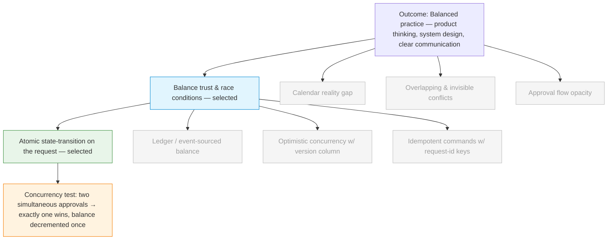

# Discovery Brief: Leave Management Take-Home

## Desired Outcome

Use the Kakitangan leave-management take-home as a **balanced practice exercise**
— sharpen product thinking, system design, and clear written communication
in one artifact. Success looks like a DESIGN.md and implementation that the
author is proud of, that demonstrates senior-level reasoning under ambiguity,
and that holds up to a follow-up technical discussion.

This is a learning outcome, not a market outcome. The "user" we design for
is still the realistic end-user of a leave system (employees and managers);
the candidate is the secondary audience the DESIGN.md is written to convince.

## Opportunity Map

| #   | Opportunity                                                                 | Evidence                                                                              | Strength                                               | Size                        |
| --- | --------------------------------------------------------------------------- | ------------------------------------------------------------------------------------- | ------------------------------------------------------ | --------------------------- |
| 1   | Balance trust & race conditions                                             | README "should consider" flags concurrent approvals, idempotency, two-manager approve | Medium (challenge author's prompt; no first-hand data) | Affects every approval path |
| 2   | Calendar reality gap (weekends, holidays, half-days, year boundary)         | README "should consider" flags weekends/holidays and half-days                        | Medium (same)                                          | Affects most requests       |
| 3   | Overlapping & invisible conflicts                                           | Implied by "prevent overlap" requirement                                              | Medium (same)                                          | Affects request creation    |
| 4   | Approval flow opacity (self-approval, missing approver, pending visibility) | Implied by "no self-approval" + manager approval requirement                          | Medium (same)                                          | Affects all stakeholders    |

Evidence is rated _medium_ across the board: the challenge author has flagged
each area as worth considering, but the candidate has no first-hand data
from real Kakitangan users. This is honest — and a strong DESIGN.md will
state this explicitly rather than pretend otherwise.

## Selected Opportunity

**#1 — Balance trust & race conditions.**

Rationale: highest depth ceiling for a senior backend role. Forces explicit
reasoning about transactions, locking strategy, idempotency, and consistency
under concurrency — territory where senior judgment is most visible and
hardest to fake with an LLM-generated answer.

The other three opportunities are **deferred, not dropped**. They will appear
in DESIGN.md's "Edge Cases Identified" and "What I Would Do With More Time"
sections, with a one-line position on each. The depth budget goes to #1.

## Solution Candidates

| #   | Solution                                              | Riskiest Assumption                                                                                                                                                                             | PRD |
| --- | ----------------------------------------------------- | ----------------------------------------------------------------------------------------------------------------------------------------------------------------------------------------------- | --- |
| 1   | **Atomic state-transition on the request** (selected) | A status compare-and-swap (or row-level lock) on the request, combined with a single transaction for the status change + balance deduction, is sufficient to serialize approvals at demo scale. | —   |
| 2   | Ledger / event-sourced balance                        | Derivation from an append-only ledger is cheap enough on the read path, and the audit/correctness gains justify the extra complexity for a demo.                                                | —   |
| 3   | Optimistic concurrency with version column            | Concurrent approvals on the same request are rare enough that retries dominate locks; the retry path is genuinely cheap.                                                                        | —   |
| 4   | Idempotent commands with request-id keys              | A keying scheme on (request_id, operation) covers every retry path — including human double-clicks, network retries, and integration retries.                                                   | —   |

Selected: **#1**. Reasoning in the Decision Log.

#2 (ledger) is the right answer at scale and will be discussed in DESIGN.md
as the upgrade path. #4 (idempotency keys) is the right answer for API
ergonomics and will be discussed as a complementary layer, not an
alternative. #3 is mentioned as a known alternative and explicitly
rejected for this size.

## Opportunity Solution Tree

## Recommended Experiment

**Concurrency test in the repo.**

Write a focused test that:

1. Creates an employee with a known balance and a single _pending_ leave
   request.
2. Fires two simultaneous approval calls against that request from two
   different manager identities.
3. Asserts: exactly one approval succeeds; the other receives a clean
   "already approved / invalid transition" response; the balance is
   decremented exactly once; the request is in the `approved` state with
   a single recorded approver.

This is the cheapest, most falsifiable way to demonstrate the leap of faith
holds. If the design is correct, the test passes deterministically. If it's
wrong, it fails — and that failure becomes a teaching moment that earns more
respect in the follow-up interview than a passing test that was never
threatened.

DESIGN.md will reference this test by name and explain _why_ it is the right
test, what assumption it falsifies, and where it would stop being sufficient
(e.g. multi-process deployments, distributed transactions).

## Recommendation

**Proceed to `/prd` for the leave-management challenge**, scoped around the
selected opportunity (balance trust under concurrency) and the selected
solution (atomic state-transition on the request) — with explicit
secondary coverage of:

- Calendar handling (weekends/holidays/half-days/year boundary) — addressed
  at the level of "what the system commits to and what is out of scope."
- Overlap detection — addressed as a date-range query in the data model.
- Approval flow rules — addressed as authorization invariants (no
  self-approval, manager-of-employee check).

The PRD should produce a single take-home submission, not a multi-story
epic. The DESIGN.md is the _primary deliverable_; the code is the evidence
that the design holds.

## Decision Log

- **Goal set to "balanced practice" rather than "land the role" or "ship to real users."**
  The candidate chose to optimize for learning across product thinking,
  system design, and communication. This shapes every downstream choice:
  we don't pretend to have user data, we don't optimize purely for reviewer
  signals, and we don't over-engineer for hypothetical scale.

- **Evidence honestly tagged "medium" — not "strong."**
  The candidate doesn't work at Kakitangan and has no first-hand user data.
  The challenge author's "should consider" list is the only evidence we
  have. DESIGN.md should be explicit that these are reasoned hypotheses,
  not validated user pains.

- **Selected "balance trust & race conditions" over the other three opportunities.**
  Highest depth ceiling for a senior backend role; concurrency reasoning is
  the area where senior judgment is hardest to fake with generated code and
  most likely to differentiate in the follow-up technical discussion.

- **Selected "atomic state-transition" over "ledger" as the lead solution.**
  At demo scale (SQLite, single process), the state-transition pattern is
  correct, simple, and defensible. The ledger pattern is the right answer
  at scale and will be acknowledged in DESIGN.md as the upgrade path —
  demonstrating senior judgment by _not_ over-engineering while showing
  awareness of where the design would need to evolve.

- **Solutions #2 (ledger) and #4 (idempotency keys) are kept as complementary topics, not alternatives.**
  The ledger is the "what I'd do with more time / at scale" answer.
  Idempotency keys are the API-ergonomics layer for safe retries —
  orthogonal to the concurrency story, but worth at least one paragraph.

- **Experiment chosen: a concurrency test in the repo, not prose.**
  A reviewer can run a test; they can only argue with prose. A passing
  concurrency test is the cheapest, most falsifiable demonstration that
  the leap of faith holds.

## Open Questions

- **Scope of overlap detection** — does "prevent overlap" mean only against
  the employee's own approved/pending leave, or also against a team-coverage
  rule (e.g. "no more than N teammates out at once")? DESIGN.md should pick
  a clear answer and call out the other as future work.
- **Half-day support** — explicitly in scope, partially in scope (model
  supports it but no API), or out of scope with a note? DESIGN.md must
  commit.
- **Public holidays** — same question: out of scope with a note, or modeled
  with a stub `Holiday` table? Either is defensible; the commitment matters.
- **Year-boundary leave** — does a leave from Dec 28 to Jan 5 deduct from
  the year it starts in, ends in, or split proportionally? DESIGN.md should
  pick one and justify.

These are all _product scope_ questions, deliberately left for the PRD to
pin down. They are not blockers to discovery completion.
