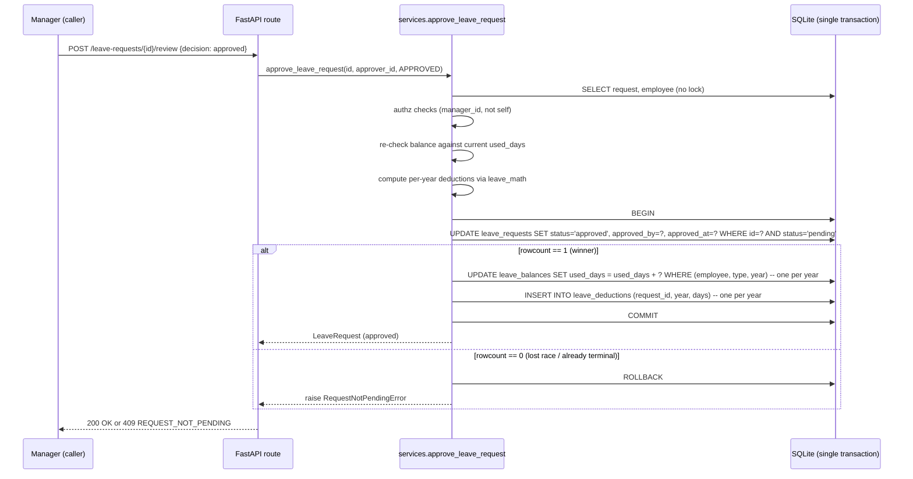

# Leave Management API

**Ticket:** TBD
**Discovery Brief:** docs/discovery/leave-management/brief.md

A leave management system for a mid-sized employer. Employees submit requests
for time off, managers approve or reject them, and the system keeps each
employee's remaining balance accurate and trustworthy — even when multiple
actors operate on the same request at the same moment. The defining quality
goal is that the **remaining-days number is always correct**, every day, no
matter how chaotic the inputs.

## User Story

As an **employee**, I want to request leave, cancel my own requests, and see
exactly how many days I have left, so that I can plan time off with full
confidence that the system's numbers match reality.

(Secondary persona: **manager** — wants to approve or reject team requests
without ever accidentally double-deducting an employee's balance, even if
another manager clicks at the same instant.)

## Background & Context

**Current state:**

- A skeleton system exists with employees, leave requests, and leave balances
  modelled. The business logic — creating requests, approving them, cancelling
  them, and reporting balances — is not yet implemented.
- The seed data shows a small Engineering team: one manager (Alice) and two
  reports (Bob, Carol), each with 14 annual and 12 sick days for the year.

**Problem:**

- Without the business logic in place, employees cannot reliably request leave,
  managers cannot approve, and nobody can trust the remaining-days number.
- The hardest sub-problem — and the one this work is most concerned with — is
  ensuring the balance stays correct when two managers approve the same request
  at the same time, when a request is cancelled twice in quick succession, or
  when a network retry sends the same approval twice. The naïve version of this
  system silently corrupts balances. The version delivered here must not.

## Target User & Persona

- **Primary user — the Employee:** wants to plan time off. Submits requests,
  cancels them when plans change, checks their remaining balance. Trusts
  the system implicitly; will lose that trust the first time the number is
  wrong.
- **Secondary user — the Manager:** approves or rejects requests from direct
  reports. Operates under time pressure, sometimes with another manager who
  shares oversight. Cannot tell from the screen whether someone else just
  clicked the same approval.

- **Context:** day-to-day operation in a small-to-mid HR system. Volume is
  modest (tens of approvals per day per company), but mistakes are visible and
  expensive — a wrong balance generates a support ticket, an HR investigation,
  and lost trust.
- **Current workaround:** spreadsheets, email threads, or manual ledgers
  maintained by HR. All slow, error-prone, and hard to audit.

## Goals

- Employees can submit, see, and cancel their own leave requests, and always
  see an accurate remaining-balance number for each leave type and year.
- Managers can approve or reject pending requests, with absolute confidence
  that an approval is recorded exactly once, even under simultaneous clicks
  or network retries.
- The system explicitly handles four calendar realities employees expect to be
  treated correctly: weekends, public holidays, half-days, and leave that
  spans across the year boundary.
- The work product (the implementation plus the supporting design document)
  demonstrates senior-level reasoning about concurrency and consistency,
  with the design choices written down in plain English.

## Non-Goals

- **Team-coverage rules.** This release does not enforce "no more than N
  teammates out at once" or any team-availability check. Overlap is detected
  only against the requesting employee's own existing leaves.
- **Notifications.** No emails, push, or in-app alerts on submission,
  approval, or rejection.
- **Carry-over of unused balance** between years.
- **Role-based access control** beyond the manager-of-employee relationship
  that already exists in the system. It uses the employee's recorded
  manager as the only approval-authority signal.
- **Leave-policy variation** by department, country, or role. Every employee
  is treated as having the same policy in this release.
- **Audit trail beyond the basics** — the system records who approved and
  when, but does not maintain a full event history for each request.

## User Workflow

### Employee submits a leave request

1. **Starting point** — The employee knows their dates and the type of leave
   they want (annual, sick, personal, etc.). They want to confirm the system
   will accept the request before they tell anyone.
2. **Action** — The employee submits the request with a leave type, a start
   date, an end date, an optional half-day marker (e.g. "half-day on the
   start date" or "half-day on the end date"), and an optional reason.
3. **Response** — One of two things happens:
   - **Accepted as pending.** The employee sees the request recorded with
     status "pending" and a deduction estimate showing how many days will
     come off their balance once a manager approves it (with weekends and
     public holidays already excluded).
   - **Rejected with a clear reason.** Examples: "you do not have enough
     annual leave for this request," "this overlaps with a leave you have
     already requested," "the start date is in the past."
4. **Completion** — The employee receives confirmation. The balance shown
   on their profile does not change yet (deduction happens on approval),
   but the pending request is visible and counted toward future overlap checks.

### Manager reviews a pending request

1. **Starting point** — The manager has a list of pending requests from
   their reports.
2. **Action** — The manager opens a request, sees the dates, the type, the
   estimated day count (already excluding weekends and public holidays),
   and the employee's remaining balance for that type. They choose approve
   or reject.
3. **Response** — One of two things happens:
   - **Approved.** The request is recorded as approved with the manager's
     identity and the timestamp. The employee's balance is deducted by
     exactly the day count shown — never more, never less, never twice,
     even if the manager double-clicks or another manager clicked the same
     button at the same moment.
   - **Rejected.** The request status changes to rejected. The balance is
     unchanged.
4. **Completion** — The decision is final. The request can no longer be
   approved or rejected. The employee can still cancel it only while
   pending (rejection is terminal).

### Employee cancels their own request

1. **Starting point** — The employee has a pending or approved leave they
   no longer need.
2. **Action** — The employee cancels the request from their own list.
3. **Response** — The status changes to cancelled. If the request was
   already approved, the balance is restored by exactly the same day count
   that was originally deducted — even across a year boundary. If the
   request was still pending, no balance change is needed.
4. **Completion** — The cancelled request is visible in history but cannot
   be revived. A second cancel click on the same request changes nothing
   and reports "already cancelled."

### Anyone checks balances or browses requests

1. **Starting point** — The viewer wants to know remaining days, or to see
   a filtered list of requests.
2. **Action** — The viewer asks for the balance for an employee and year,
   or browses requests filtered by employee, status, type, and date range,
   with pagination.
3. **Response** — Results are returned with total and used days per leave
   type and year, or a paginated list of requests matching the filters.
4. **Completion** — Numbers shown match the actual recorded state of the
   system at the moment of the query.

## Acceptance Criteria

> All scenarios are written from the perspective of an Employee or Manager
> interacting with the system. They cover happy paths, error cases, and the
> four committed scope decisions: own-leaves overlap, fractional half-days,
> weekends + public holidays excluded, and proportional cross-year deduction.

### Scenario: Employee submits a valid leave request

```gherkin
Given Bob has 14 annual leave days remaining for this year
  And Bob has no other pending or approved annual leave
When Bob submits an annual leave request from Monday June 1 to Wednesday June 3
Then the request is recorded with status "pending"
  And the deduction estimate shown is 3 days
  And Bob's remaining annual balance still reads 14 days
```

### Scenario: Employee submits a request that exceeds their balance

```gherkin
Given Bob has 2 annual leave days remaining for this year
When Bob submits an annual leave request from Monday June 1 to Friday June 5
Then the request is rejected
  And Bob sees the message "insufficient annual leave balance: 5 days requested, 2 days available"
  And no request is recorded
```

### Scenario: Employee submits a request that overlaps their own existing leave

```gherkin
Given Bob already has a pending annual leave request from June 10 to June 12
When Bob submits a new annual leave request from June 11 to June 15
Then the new request is rejected
  And Bob sees the message "this request overlaps with an existing leave request from June 10 to June 12"
  And no new request is recorded
```

### Scenario: Employee submits a back-dated request

```gherkin
Given today's date is June 5
When Bob submits a leave request with a start date of June 1
Then the request is rejected
  And Bob sees the message "start date cannot be in the past"
```

### Scenario: Employee submits a request where the end date is before the start

```gherkin
Given today's date is June 1
When Bob submits a leave request from June 10 to June 5
Then the request is rejected
  And Bob sees the message "end date cannot be before start date"
```

### Scenario: Half-day leave is supported as a fractional deduction

```gherkin
Given Bob has 14 annual leave days remaining
When Bob submits an annual leave request for Monday June 1 marked as a half-day
Then the request is recorded with status "pending"
  And the deduction estimate shown is 0.5 days
```

### Scenario: Leave spanning a weekend skips the weekend in the deduction

```gherkin
Given Bob has 14 annual leave days remaining
  And Saturday June 6 and Sunday June 7 are weekend days
When Bob submits an annual leave request from Friday June 5 to Monday June 8
Then the request is recorded with status "pending"
  And the deduction estimate shown is 2 days
```

### Scenario: Leave spanning a public holiday skips the holiday in the deduction

```gherkin
Given Bob has 14 annual leave days remaining
  And Wednesday August 12 is a recorded public holiday
When Bob submits an annual leave request from Monday August 10 to Friday August 14
Then the request is recorded with status "pending"
  And the deduction estimate shown is 4 days
```

### Scenario: Leave that crosses the year boundary splits deduction across both years

```gherkin
Given Bob has 5 annual leave days remaining for the current year
  And Bob has 14 annual leave days remaining for the following year
  And December 29 to 31 are 3 weekdays
  And January 1 is a public holiday and January 2 to 5 are 4 weekdays
When Bob submits an annual leave request from December 29 to January 5
Then the request is recorded with status "pending"
  And the deduction estimate shows 3 days against the current year and 4 days against the following year
```

### Scenario: Manager approves a pending request

```gherkin
Given Bob has 14 annual leave days remaining
  And Bob has submitted a 3-day annual leave request that is currently pending
  And Alice is Bob's manager
When Alice approves the request
Then the request status changes to "approved"
  And the approval records Alice as the approver and the current time
  And Bob's remaining annual balance is now 11 days
```

### Scenario: Manager rejects a pending request

```gherkin
Given Bob has submitted a 3-day annual leave request that is currently pending
  And Alice is Bob's manager
When Alice rejects the request
Then the request status changes to "rejected"
  And the rejection records Alice as the approver and the current time
  And Bob's remaining balance is unchanged
```

### Scenario: A manager cannot approve their own leave request

```gherkin
Given Alice has submitted her own leave request and is the only manager on record
When Alice attempts to approve her own request
Then the request is not approved
  And Alice sees the message "you cannot approve your own leave request"
  And the request remains in "pending" status
```

### Scenario: A request that is already approved cannot be approved again

```gherkin
Given Bob's leave request is already in "approved" status
When any manager attempts to approve the same request a second time
Then the action is rejected
  And the manager sees the message "this request is no longer pending"
  And Bob's balance is unchanged from its post-first-approval value
```

### Scenario: Two managers approve the same pending request at the same moment

```gherkin
Given Bob has 14 annual leave days remaining
  And Bob has submitted a 3-day annual leave request that is currently pending
  And both Alice and David have manager authority over Bob
When Alice and David approve the same request at the exact same instant
Then exactly one of them is recorded as the approver
  And the other receives the message "this request is no longer pending"
  And Bob's remaining annual balance is exactly 11 days — not 8, not 14
```

### Scenario: A manager double-clicks the approve action

```gherkin
Given Bob has 14 annual leave days remaining
  And Bob has submitted a 3-day annual leave request that is currently pending
When Alice clicks "approve" twice in quick succession on the same request
Then the request is approved exactly once
  And Bob's remaining annual balance is exactly 11 days
```

### Scenario: Manager tries to approve, but balance changed between submission and approval

```gherkin
Given Bob submitted a 5-day annual leave request when he had 5 days available
  And in the meantime Bob's balance has dropped to 2 days because of another approved leave
When Alice tries to approve the original request
Then the approval is rejected
  And Alice sees the message "Bob no longer has enough balance for this request"
  And Bob's balance is unchanged
  And the request remains "pending"
```

### Scenario: Employee cancels a pending request

```gherkin
Given Bob has a pending leave request that has not been approved
When Bob cancels the request
Then the status changes to "cancelled"
  And Bob's balance is unchanged
```

### Scenario: Employee cancels an approved request and balance is restored

```gherkin
Given Bob had 14 annual leave days
  And a 3-day annual leave request from Bob was approved, leaving him with 11 days
When Bob cancels the approved request
Then the status changes to "cancelled"
  And Bob's remaining annual balance is restored to exactly 14 days
```

### Scenario: Employee cancels a year-spanning approved request and both years are restored

```gherkin
Given a 7-day leave request from Bob was approved spanning Dec 29 to Jan 5
  And the approval deducted 3 days from the current year and 4 days from the following year
When Bob cancels the approved request
Then 3 days are restored to the current year's balance
  And 4 days are restored to the following year's balance
```

### Scenario: A non-owner cannot cancel another employee's request

```gherkin
Given Carol has a pending leave request
When Bob attempts to cancel Carol's request
Then the action is rejected
  And Bob sees the message "only the request owner can cancel this leave"
  And Carol's request is unchanged
```

### Scenario: Cancelling an already-cancelled request changes nothing

```gherkin
Given Bob's leave request is already in "cancelled" status
When Bob cancels the same request again
Then the action is rejected with the message "this request is already cancelled"
  And no balance change occurs
```

### Scenario: A rejected request cannot be cancelled

```gherkin
Given Bob's leave request was rejected by Alice
When Bob attempts to cancel the rejected request
Then the action is rejected with the message "rejected requests cannot be cancelled"
```

### Scenario: An employee with no balance record for a year sees zero, not an error

```gherkin
Given Bob has no recorded balance for paternity leave in the current year
When Bob's profile is viewed for the current year
Then Bob's paternity balance shows total 0, used 0, remaining 0
  And no error is reported
```

### Scenario: Listing leave requests with filters and pagination

```gherkin
Given the system holds 35 leave requests across multiple employees, statuses, and types
When a viewer asks for approved annual leave requests for the Engineering department, page 2 with a page size of 10
Then exactly the matching requests for page 2 are returned
  And the response includes the total count of all matching requests, the current page number, and the page size
```

### Scenario Outline: Common invalid request submissions are rejected with a clear reason

```gherkin
Given today's date is June 1 of the current year
When an employee submits a leave request with <problem>
Then the request is rejected with the message <message>

Examples:
  | problem                            | message                                              |
  | a start date earlier than today    | "start date cannot be in the past"                   |
  | an end date earlier than the start | "end date cannot be before start date"               |
  | a leave type that is not allowed   | "unknown leave type"                                 |
  | a request that spans no working days (all weekend / holiday) | "this request covers no working days" |
```

## Business Rules & Constraints

- **Day-count rule.** The number of days deducted from a balance is the count
  of weekdays (Monday through Friday) in the requested date range, minus any
  configured public holidays in that range, with each end of the range
  contributing a full day or half a day depending on the half-day markers.
  Half-day on a weekend or public holiday counts as zero.
- **Cross-year split.** When a request spans the calendar boundary, the
  deduction is split: days in the starting year deduct from that year's
  balance for the requested type; days in the next year deduct from the
  following year's balance. Both years' balances must be sufficient or the
  request is rejected at submission. Approval re-checks both balances.
- **Own-leaves overlap rule.** A new request is rejected if its date range
  overlaps any of the same employee's existing pending or approved requests
  (regardless of leave type). Cancelled and rejected requests do not block.
- **Approval is one-shot and exactly-once.** Once a request leaves "pending"
  for any reason — approved, rejected, or cancelled — no further state
  change is accepted on that request. Concurrent approvals on the same
  request resolve to a single winner, with the others seeing "this request
  is no longer pending."
- **Cancellation is one-shot and exactly-once.** A cancellation of an
  approved request restores the original deducted amount exactly once,
  across both years if applicable. Duplicate cancellations are no-ops.
- **No self-approval.** An approver cannot be the same person as the
  requesting employee.
- **Only the owner cancels.** Anyone other than the requesting employee
  attempting to cancel the request is refused.
- **Past dates are immutable.** A request with a start date earlier than
  today is rejected at submission. Approving a request never changes the
  dates.
- **Listing & pagination.** Lists can be filtered by employee, status,
  leave type, and an inclusive date range. Pagination is one-based with a
  configurable page size (default 20, maximum 100). Every list response
  reports the total count of matching items so the caller can paginate
  predictably.
- **Balance returns zero, not an error, when no record exists** for a given
  employee, leave type, and year.

## Success Metrics

- **Correctness under concurrent operations.** When two simultaneous
  approvals are issued against the same pending request, exactly one is
  accepted and the balance is decremented exactly once. This is verified
  by an explicit concurrency scenario in the test suite.
- **Balance integrity across an approval-then-cancel cycle.** For any
  approved-then-cancelled request — including year-spanning ones — the
  employee's balance is restored to its pre-approval value, exactly. No
  drift after repeated cycles.
- **Validation coverage.** Every rule listed under "Business Rules" has at
  least one corresponding scenario in the test suite that exercises both
  the accept and reject paths.
- **Design clarity.** A reader of the accompanying design document can
  state, in their own words, what guarantees the system makes about
  balance integrity and why those guarantees hold — without needing to read
  the code.

## Dependencies

- An existing record of employees, including each employee's recorded
  manager. The manager-of relationship is the only approval-authority
  signal used in this release.
- A recorded leave-balance entry per employee, leave type, and year.
  Missing entries are interpreted as zero balance, not an error.
- A recorded list of public-holiday dates for the relevant calendar years.
  Without this list, the day-count rule treats every weekday as a working
  day.

## Open Questions

- [x] ~~How should overlap be detected — own leaves only, or with a team-coverage cap?~~ — **Resolved:** Own leaves only. Team-coverage rules are explicitly deferred and called out in the design document.
- [x] ~~Should half-day leave be supported?~~ — **Resolved:** Yes — fractional days are supported via half-day markers on the request. Balance math handles fractions.
- [x] ~~Should weekends and public holidays be excluded from the day count?~~ — **Resolved:** Yes — both are excluded. A holiday list must be present in the system; if it is not, only weekends are excluded.
- [x] ~~How should leave spanning a year boundary be handled?~~ — **Resolved:** Proportional split. Days in each calendar year deduct from that year's balance. Both years must have sufficient balance at submission and at approval.
- [ ] **How are public holidays loaded into the system in the first place?** — **Deferred (non-blocking):** for this release, the holiday list is seeded along with the demo data. Production loading mechanisms (admin import, regional calendars) are out of scope.
- [ ] **What happens when an employee's manager is unknown or has left the company?** — **Deferred (non-blocking):** this release assumes every employee has a valid recorded manager. Re-assignment policy is a separate piece of work.

---

## Functional Requirements

- **Atomicity.** Every state transition that changes a `LeaveRequest.status` and any
  `LeaveBalance.used_days` row(s) must commit in a single database transaction.
  Any failure rolls back both — never half-applied.
- **Exactly-once approval.** The transition `pending → approved` uses a conditional
  `UPDATE ... WHERE id = :id AND status = 'pending'`. The driver's `rowcount`
  determines the winner: `1` = this caller is the unique approver; `0` = someone
  else won (or the request is no longer pending) and the caller receives
  `409 REQUEST_NOT_PENDING`. The balance deduction happens only in the winning
  transaction.
- **Exactly-once cancellation.** Same compare-and-swap pattern, transitioning from
  `pending` or `approved` to `cancelled`. Restoration of balance is conditioned on
  the **prior status being `approved`** AND on a matching row existing in
  `leave_deductions` for the request — never recomputed from dates at cancel time.
- **Deduction is recorded, not recomputed.** When a request is approved, every
  per-year deduction is written to a `leave_deductions` row keyed by
  `(leave_request_id, year)`. Cancellation reads those rows and reverses each one
  exactly. Public-holiday changes after approval cannot drift the restored balance.
- **No-op idempotency.** A second cancel of an already-cancelled request returns
  `409 ALREADY_CANCELLED` and changes nothing. A second approve of a non-pending
  request returns `409 REQUEST_NOT_PENDING`.
- **Validation order.** For `create_leave_request`, validate cheapest-first:
  date sanity (start ≤ end, start ≥ today) → leave-type valid → working-day count
  > 0 → no own-leaves overlap → sufficient balance in every affected year.
  > Stop and return on the first failure with a structured error.

### Validation & Business Rules

- **Working-day count** is computed as: number of weekdays (Mon–Fri) in
  `[start_date, end_date]`, minus any rows in `holidays` whose `date` falls in
  that inclusive range and lies on a weekday. Each end-of-range day contributes
  `1.0` by default, or `0.5` if its half-day marker is set; a half-day that lands
  on a weekend or holiday contributes `0.0`.
- **No working days → reject** with `422 NO_WORKING_DAYS` and message
  `"this request covers no working days"`.
- **Cross-year split.** If `start_date.year != end_date.year`, the working-day count
  is partitioned by year and each year's portion is checked against
  `LeaveBalance(employee_id, leave_type, year).remaining_days`. If any partition
  has insufficient balance, the whole request is rejected with
  `422 INSUFFICIENT_BALANCE` naming the year that failed.
- **Half-day markers** are independent booleans. Both can be true only when
  `start_date == end_date` (a single-day request that is half-day on the morning
  and half-day on the afternoon collapses to a full day — but the spec models
  this as a single boolean `half_day` for the same-day case). For multi-day
  requests, `half_day_start` applies only to `start_date` and `half_day_end` only
  to `end_date`.
- **Leave type** must be one of the `LeaveType` enum values; unknown types return
  `422 UNKNOWN_LEAVE_TYPE`.

## Permissions & Security

- **Scope:** internal HR API. Authentication is out of scope for this release —
  the API trusts the caller to identify themselves via path/query parameters
  (`employee_id`, `approver_id`). A real deployment would put this behind a
  session-based auth layer; the design document calls this out.
- **Authorization rules (enforced in the service layer):**
  - **Approver authorization:** the approver passed to `approve_leave_request`
    must equal the requesting employee's `manager_id`. Otherwise return
    `403 NOT_AUTHORIZED_APPROVER`.
  - **Self-approval forbidden:** the approver may not equal the requesting
    employee, even if they are also a manager. Returns `403 SELF_APPROVAL`.
  - **Cancel ownership:** the `employee_id` parameter on cancel must equal
    `LeaveRequest.employee_id`. Otherwise return `403 NOT_REQUEST_OWNER`.
- **Input validation** (FastAPI/Pydantic at the boundary):
  - All dates parsed as `date` (ISO-8601). Invalid → `422`.
  - `page` ≥ 1, `page_size` between 1 and 100 (current `app.py` already enforces).
  - `reason` capped at 500 characters; trimmed; stored as-is otherwise.
  - Enum coercion via Pydantic — unknown values rejected before reaching the service.
- **No PII in logs.** Log only `leave_request_id`, `employee_id`, `status`,
  and decision outcomes. Never log `reason`, names, or emails.

## System Design

### Components

- **`src/app.py` (FastAPI routes — thin).** Parses inputs, calls the service,
  translates `LeaveError` subclasses into HTTP status + error code. Already
  largely wired; needs minor updates (half-day fields, real `approver_id`).
- **`src/services.py` (business logic — the seat of the work).** Implements all
  five workflow functions. Owns the transactional boundaries and the
  compare-and-swap pattern. Calls into `leave_math` for pure calculations.
- **`src/leave_math.py` (new — pure functions).** Day-counting, half-day rules,
  weekend/holiday exclusion, year-boundary partitioning. No I/O, no SQLAlchemy.
  Independently unit-tested.
- **`src/models.py` (SQLAlchemy models).** Adds `Holiday` and `LeaveDeduction`
  tables; adds `half_day_start`, `half_day_end` to `LeaveRequest`.
- **`src/database.py`.** Unchanged structurally; one note added that
  `Base.metadata.create_all` is acceptable only for this demo — production would
  use Alembic.

### Interfaces

- **HTTP endpoints** — see [API Design](#api-design) below. JSON in, JSON out.
- **Service contract** — exceptions (`InsufficientBalanceError`,
  `OverlappingLeaveError`, `SelfApprovalError`, `RequestNotPendingError`,
  `NotRequestOwnerError`, `NotAuthorizedApproverError`, `NoWorkingDaysError`,
  `UnknownLeaveTypeError`, `BackdatedRequestError`, `InvalidDateRangeError`,
  `AlreadyCancelledError`, `RejectedRequestNotCancellableError`) — all subclasses
  of `LeaveError`. The route layer maps each to a `(status_code, error_code)`
  pair via a single dict.
- **Database schema** — see [Data Model & Migrations](#data-model--migrations).

### Data flow — approving a request



### Tradeoffs considered

1. **Atomic compare-and-swap on status (chosen).** Single `UPDATE ... WHERE
status='pending'` driven by `rowcount`. Combined with a single transaction
   covering balance update + deduction record, this serializes approvals
   correctly on SQLite (which already serializes writers). Cheap, defensible,
   matches the discovery brief's selected solution.
2. **Pessimistic row locks (`SELECT ... FOR UPDATE`).** Considered and rejected
   — SQLite does not support `FOR UPDATE`, and on PostgreSQL the CAS pattern is
   equally correct without the locking ceremony. Would lose portability gain
   for nothing.
3. **Optimistic concurrency with a `version` column.** Considered. Requires the
   client to round-trip a version number; complicates the API and the test
   matrix. Discovery brief explicitly rejected this for the scale we ship to.
4. **Event-sourced / ledger-based balance.** Right answer at large scale. Adds a
   write-side and a projection — too much complexity for a single-process demo.
   Called out in `DESIGN.md` as the upgrade path; not implemented.

Decision recorded in **[docs/adr/001-atomic-state-transition.md](../../adr/001-atomic-state-transition.md)**.

## Threat Model Checklist

- **Data classification.** PII: employee names and emails (low sensitivity,
  scoped to one tenant). Leave `reason` may contain sensitive disclosures
  (medical, family). **Mitigation:** `reason` is never logged and not returned
  in list endpoints by default; only the owner or their manager should see it.
  Out of scope for this release to enforce; flagged in `DESIGN.md`.
- **Attack surface.** New endpoints: none beyond what's already in `app.py`.
  No deserializers beyond Pydantic. No file uploads. No redirects.
- **Authn / authz changes.** No authentication added. Authorization is rule-based
  in the service layer (manager-of-employee, owner-of-request). The
  `approver_id` is passed by the caller and trusted — explicitly called out as
  a demo limitation. A production deployment must put this behind a real auth
  layer before exposing it.
- **Dependency additions.** None. The implementation uses only the packages
  already in `requirements.txt`.
- **Injection / DoS risk.** All queries go through SQLAlchemy ORM with bound
  parameters — no string-built SQL. Pagination is capped at `page_size=100` by
  the route layer (already enforced).

## API Design

All errors return `{"detail": "<human-readable>", "code": "<ERROR_CODE>"}`. The
current `app.py` uses FastAPI's default `{"detail": ...}` shape — the
implementation will extend this to include `code` by raising
`HTTPException(status_code=..., detail={"detail": "...", "code": "..."})` or via
a small exception handler. Either is acceptable; pick one and use it consistently.

### `POST /leave-requests`

**Request:**

```json
{
  "employee_id": 2,
  "leave_type": "annual",
  "start_date": "2026-06-01",
  "end_date": "2026-06-03",
  "half_day_start": false,
  "half_day_end": false,
  "reason": "Family trip to Penang"
}
```

**Response (201):**

```json
{
  "id": 42,
  "employee_id": 2,
  "leave_type": "annual",
  "start_date": "2026-06-01",
  "end_date": "2026-06-03",
  "half_day_start": false,
  "half_day_end": false,
  "reason": "Family trip to Penang",
  "status": "pending",
  "approved_by": null,
  "approved_at": null,
  "estimated_deductions": [{ "year": 2026, "days": 3.0 }]
}
```

**Errors:**

| Status | Code                   | Condition                                                |
| ------ | ---------------------- | -------------------------------------------------------- |
| 404    | `EMPLOYEE_NOT_FOUND`   | `employee_id` does not match any employee                |
| 422    | `INVALID_DATE_RANGE`   | `end_date < start_date`                                  |
| 422    | `BACKDATED_REQUEST`    | `start_date < today`                                     |
| 422    | `UNKNOWN_LEAVE_TYPE`   | `leave_type` not in `LeaveType` enum                     |
| 422    | `NO_WORKING_DAYS`      | The range contains no working days (all weekend/holiday) |
| 422    | `OVERLAPPING_LEAVE`    | Overlaps an existing pending/approved request            |
| 422    | `INSUFFICIENT_BALANCE` | Not enough balance in some year (message names year)     |

### `POST /leave-requests/{id}/review`

**Request:**

```json
{
  "approver_id": 1,
  "decision": "approved"
}
```

`approver_id` is added to the existing `LeaveRequestApprove` schema (currently
hardcoded to `1` in `app.py:153`).

**Response (200):**

```json
{
  "id": 42,
  "employee_id": 2,
  "leave_type": "annual",
  "status": "approved",
  "approved_by": 1,
  "approved_at": "2026-05-30T09:15:42Z",
  "deductions": [{ "year": 2026, "days": 3.0 }]
}
```

**Errors:**

| Status | Code                      | Condition                                                   |
| ------ | ------------------------- | ----------------------------------------------------------- |
| 404    | `LEAVE_REQUEST_NOT_FOUND` | `id` does not match any request                             |
| 403    | `NOT_AUTHORIZED_APPROVER` | `approver_id` is not the employee's recorded manager        |
| 403    | `SELF_APPROVAL`           | `approver_id == employee_id`                                |
| 409    | `REQUEST_NOT_PENDING`     | Request is no longer pending (race lost / already terminal) |
| 422    | `INSUFFICIENT_BALANCE`    | Balance dropped between submission and approval             |

### `POST /leave-requests/{id}/cancel`

**Request:** `?employee_id=2` (query param, as in current `app.py`).

**Response (200):**

```json
{
  "id": 42,
  "status": "cancelled",
  "restored_deductions": [{ "year": 2026, "days": 3.0 }]
}
```

**Errors:**

| Status | Code                       | Condition                                        |
| ------ | -------------------------- | ------------------------------------------------ |
| 404    | `LEAVE_REQUEST_NOT_FOUND`  | `id` does not match any request                  |
| 403    | `NOT_REQUEST_OWNER`        | `employee_id` does not match the request's owner |
| 409    | `ALREADY_CANCELLED`        | Status is already `cancelled`                    |
| 409    | `REJECTED_NOT_CANCELLABLE` | Status is `rejected` — rejection is terminal     |

### `GET /leave-requests`

Filters and pagination as in current `app.py`. Response unchanged in shape; the
implementation must populate `total` with the unfiltered count of matching rows
(not the page length).

### `GET /leave-balances/{employee_id}`

Returns one `LeaveBalanceOut` per `(leave_type, year)` for the employee. If
`year` query param is omitted, defaults to `date.today().year`. If no
`LeaveBalance` row exists for a given `(employee_id, leave_type, year)`, the
endpoint returns a synthesized row with `total_days=0`, `used_days=0`,
`remaining_days=0` for **every** `LeaveType` enum value. This satisfies the
"zero, not error" rule from the business spec.

## Data Model & Migrations

### Modified table: `leave_requests`

Add two columns:

| Field            | Type    | Constraints               | Description                       |
| ---------------- | ------- | ------------------------- | --------------------------------- |
| `half_day_start` | Boolean | NOT NULL, default `false` | Half-day marker on the start date |
| `half_day_end`   | Boolean | NOT NULL, default `false` | Half-day marker on the end date   |

For same-day requests (`start_date == end_date`), only `half_day_start` is
honored; `half_day_end` is ignored (and should be left false by the client).

### New table: `holidays`

| Field        | Type     | Constraints       | Description                             |
| ------------ | -------- | ----------------- | --------------------------------------- |
| `id`         | Integer  | PK, autoincrement | Surrogate key                           |
| `date`       | Date     | NOT NULL, UNIQUE  | The holiday date                        |
| `name`       | String   | NOT NULL          | Human-readable name (e.g., "Hari Raya") |
| `created_at` | DateTime | default `utcnow`  | Audit                                   |

Indexed on `date` (via UNIQUE constraint). Queried by date range:
`SELECT date FROM holidays WHERE date BETWEEN :start AND :end`.

### New table: `leave_deductions`

| Field              | Type     | Constraints                                 | Description                                 |
| ------------------ | -------- | ------------------------------------------- | ------------------------------------------- |
| `id`               | Integer  | PK, autoincrement                           | Surrogate key                               |
| `leave_request_id` | Integer  | FK → `leave_requests.id`, NOT NULL, indexed | The approved request that produced this row |
| `year`             | Integer  | NOT NULL                                    | Calendar year this deduction applies to     |
| `days`             | Float    | NOT NULL, CHECK (`days > 0`)                | Days deducted from `(employee, type, year)` |
| `created_at`       | DateTime | default `utcnow`                            | Audit (when the approval happened)          |

UNIQUE constraint on `(leave_request_id, year)` to guarantee a deduction is
recorded at most once per (request, year) — the database-level safety net for
exactly-once approval.

### Migration notes

- No formal migration tool (Alembic) for this demo. `Base.metadata.create_all`
  in `src/app.py` will pick up the new tables and columns on next startup
  against a fresh SQLite file. Existing `kakitangan.db` files should be deleted
  (`make clean`) to apply the schema cleanly.
- The `seed_demo_data` function must be extended to insert a handful of
  holidays — at minimum one weekday holiday this year and one on January 1st of
  next year (for the year-boundary scenario).
- Document in `DESIGN.md` that Alembic would be the right answer in production.

## Architecture Notes

- **New dependencies:** none. Existing `fastapi`, `sqlalchemy`, `pytest`,
  `httpx` are sufficient.
- **Integration points:** the only external surface is HTTP. No message
  queues, no scheduled jobs, no email.
- **Concurrency boundary:** SQLite serializes write transactions. The
  compare-and-swap `UPDATE` returns `rowcount` reliably for the affected-rows
  check. For the test harness, in-memory SQLite (`sqlite:///:memory:`) is used —
  the same engine, so the concurrency mechanism behaves identically.
- **Time source:** every `datetime.utcnow()` call goes through a single
  `now_utc()` helper in `src/services.py` to enable test-time mocking
  (frozen-time tests for back-dating and year-boundary scenarios).
- **Today's date for back-date checks:** routed through a `today()` helper for
  the same reason — tests must be able to freeze "today" to evaluate scenarios
  like "June 5" vs "today is June 1".

## Exemplar Files

- `src/services.py` (current state) — function signatures already match the
  contract. The `LeaveError` hierarchy is the right base; extend it with the
  new exception types listed in [System Design > Interfaces](#interfaces).
- `src/app.py:103-167` — route-to-service pattern. Follow this exactly:
  Pydantic body → service call → catch `LeaveError` → `HTTPException`.
- `DESIGN.template.md` at the repo root — the design document deliverable
  follows this skeleton, filled in with the actual decisions taken here.

## Implementation Plan

### Sub-tasks

**Task 1: Schema changes (Holiday, LeaveDeduction, half-day fields)** — _small_

- Files: `src/models.py`
- INDEPENDENT
- Add `Holiday` model, `LeaveDeduction` model, `half_day_start`/`half_day_end`
  columns to `LeaveRequest`. Add the `__table_args__` UNIQUE constraint on
  `leave_deductions(leave_request_id, year)`.

**Task 2: Pure date math module** — _medium_

- Files: `src/leave_math.py` (new), `tests/test_leave_math.py` (new)
- INDEPENDENT (does not import from `models`/`services`)
- Functions: `count_working_days(start, end, half_day_start, half_day_end,
holidays: set[date]) -> float`, `partition_by_year(start, end,
half_day_start, half_day_end, holidays) -> dict[int, float]`. Unit-tested in
  isolation with at least 15 cases covering weekends, holidays, half-days,
  year-spanning, all-weekend ranges, and single-day half-days.

**Task 3: Service implementation — read paths** — _small_

- Files: `src/services.py`
- SEQUENTIAL (depends on Task 1)
- Implement `get_leave_requests` (filters + pagination + total count) and
  `get_leave_balances` (synthesizes zero rows for missing `LeaveType` enum
  values).

**Task 4: Service implementation — create_leave_request** — _medium_

- Files: `src/services.py`
- SEQUENTIAL (depends on Tasks 1, 2)
- Implements validation order: dates → leave type → working-day count →
  overlap → balance (per year). Raises the specific `LeaveError` subclass per
  failure. Persists the request as `PENDING` with no deduction rows.

**Task 5: Service implementation — approve_leave_request (the headline)** — _medium_

- Files: `src/services.py`
- SEQUENTIAL (depends on Tasks 1, 2)
- Re-checks balance, then runs the compare-and-swap `UPDATE`, then in the same
  transaction writes the per-year `leave_balances.used_days +=` updates and
  inserts the `leave_deductions` rows. Handles `REJECTED` decisions as a
  status-only CAS with no balance change.

**Task 6: Service implementation — cancel_leave_request** — _small_

- Files: `src/services.py`
- SEQUENTIAL (depends on Tasks 1, 2, 5)
- CAS from `pending`/`approved` to `cancelled`. If the prior status was
  `approved`, reverses every matching `leave_deductions` row and zeros (or
  deletes) those rows so a second cancel is a true no-op.

**Task 7: API wiring updates** — _small_

- Files: `src/app.py`
- SEQUENTIAL (depends on Task 1)
- Add `half_day_start`/`half_day_end` to `LeaveRequestCreate` and
  `LeaveRequestOut`; add `approver_id` to `LeaveRequestApprove` and pass it
  through (remove the hardcoded `approver_id=1`); add an exception-to-HTTP
  mapping (a single dict keyed by `LeaveError` subclass) so the route handlers
  return the right `(status_code, code)` pair instead of blanket `422`.

**Task 8: Seed data extension** — _small_

- Files: `src/services.py` (`seed_demo_data`)
- SEQUENTIAL (depends on Task 1)
- Insert a handful of `Holiday` rows: at minimum one weekday holiday in the
  current year and `January 1` of the following year. Add a fourth employee
  `David` (also a manager candidate) for the multi-approver scenario.

**Task 9: Unit tests — services** — _medium_

- Files: `tests/test_services.py`
- SEQUENTIAL (depends on Tasks 3, 4, 5, 6, 8)
- Expand the existing skeleton into ~25 test methods covering every business
  rule and every error code. Includes the **concurrency test** — see
  [Test Scenarios > Concurrency](#test-scenarios) below.

**Task 10: Integration tests — API** — _small_

- Files: `tests/test_api.py`
- SEQUENTIAL (depends on Task 7, 9)
- Replace the placeholder tests with TestClient-driven assertions for one
  happy-path and one error-path per endpoint, asserting both status code and
  `code` field.

**Task 11: DESIGN.md** — _medium_

- Files: `DESIGN.md` (new, based on `DESIGN.template.md`)
- INDEPENDENT (can be drafted in parallel once Task 5 is settled)
- The primary deliverable. Covers the six sections in the template: API design,
  data model, edge cases, tradeoffs (including the atomic-CAS-vs-ledger
  decision with a forward pointer to the ADR), what-with-more-time, and
  running the project.

### Negative Constraints

- Do **NOT** modify `src/database.py` beyond adding the `now_utc()`/`today()`
  helpers if you put them there (you may put them in `services.py` instead).
- Do **NOT** introduce Alembic or any migration tool — `create_all` is the
  agreed approach for this demo. Mention Alembic in `DESIGN.md`, do not wire it.
- Do **NOT** add an authentication layer, JWT, session middleware, or any
  user-impersonation guard. The `approver_id`/`employee_id` parameters are
  trusted by design for this release.
- Do **NOT** add background jobs, schedulers, or notification mechanisms — all
  explicitly out of scope per the business spec.
- Do **NOT** add new third-party dependencies. Implementation must use only
  packages already in `requirements.txt`.
- Do **NOT** change the existing route paths or HTTP verbs in `src/app.py`. You
  may add fields to request/response bodies; you may not rename or relocate
  endpoints.

## Test Scenarios

Each test below is implementation-level: it names the exact entities, endpoints,
error codes, and DB assertions. These complement (do not duplicate) the
Acceptance Criteria above.

**Test 1: Happy-path approval deducts exactly once**

- Setup: Bob (`id=2`) has `LeaveBalance(annual, year=2026, total=14, used=0)`.
  Bob submits annual leave from Mon `2026-06-01` to Wed `2026-06-03`.
- Action: `POST /leave-requests/{id}/review` with `approver_id=1` (Alice),
  `decision=approved`.
- Expected: response 200, `status="approved"`, `approved_by=1`, `approved_at`
  non-null. `LeaveBalance(bob, annual, 2026).used_days == 3.0`. Exactly one
  row in `leave_deductions` with `(leave_request_id=..., year=2026, days=3.0)`.

**Test 2: Insufficient balance at submission**

- Setup: Bob's annual balance is `total=2, used=0` for 2026.
- Action: submit annual leave Mon `2026-06-01` to Fri `2026-06-05` (5 working days).
- Expected: `422 INSUFFICIENT_BALANCE`, message includes "5 days requested,
  2 days available". No row in `leave_requests`. No row in `leave_deductions`.

**Test 3: Own-leaves overlap**

- Setup: Bob has a pending annual request `2026-06-10` to `2026-06-12`.
- Action: submit a new annual request `2026-06-11` to `2026-06-15`.
- Expected: `422 OVERLAPPING_LEAVE`. The existing pending request is unchanged;
  no new row in `leave_requests`. Verify the overlap check ignores cancelled
  and rejected requests by repeating the test with the existing one in those
  statuses — submission should succeed.

**Test 4: Back-dated request**

- Setup: freeze `today()` to `2026-06-05`.
- Action: submit a request with `start_date=2026-06-01`.
- Expected: `422 BACKDATED_REQUEST`.

**Test 5: Half-day deduction**

- Setup: Bob's annual balance `total=14, used=0`. Today is `2026-05-29`.
- Action: submit annual leave for `2026-06-01` to `2026-06-01` with
  `half_day_start=true`.
- Expected: 201 created, response shows `estimated_deductions=[{year:2026, days:0.5}]`.
  After approval, `used_days == 0.5`.

**Test 6: Weekend exclusion**

- Setup: Bob's annual balance `total=14, used=0`. `2026-06-06` is a Saturday
  and `2026-06-07` is a Sunday.
- Action: submit annual leave Fri `2026-06-05` to Mon `2026-06-08`.
- Expected: 201 created, `estimated_deductions=[{year:2026, days:2.0}]`.

**Test 7: Public-holiday exclusion**

- Setup: seed `holidays` with `2026-08-12` named "Public Holiday".
  Bob's annual balance `total=14, used=0`.
- Action: submit annual leave Mon `2026-08-10` to Fri `2026-08-14`.
- Expected: 201 created, `estimated_deductions=[{year:2026, days:4.0}]`.

**Test 8: Year-boundary split**

- Setup: Bob has `LeaveBalance(annual, 2026, total=14, used=9)` (5 remaining)
  and `LeaveBalance(annual, 2027, total=14, used=0)`. Holiday `2027-01-01`.
- Action: submit annual leave `2026-12-29` to `2027-01-05`.
- Expected: 201 created, `estimated_deductions=[{year:2026, days:3.0},
{year:2027, days:4.0}]`. After approval, `used_days` is `12.0` for 2026 and
  `4.0` for 2027. `leave_deductions` has exactly two rows.

**Test 9: Self-approval blocked**

- Setup: Alice (`id=1`, manager of nobody but herself in this test) has a
  pending request.
- Action: `POST /leave-requests/{id}/review` with `approver_id=1`,
  `decision=approved`.
- Expected: `403 SELF_APPROVAL`. Request remains `pending`. No balance change.

**Test 10: Re-approval of an already-approved request**

- Setup: A request is already in `approved` status with `used_days=3.0`.
- Action: `POST /leave-requests/{id}/review` again with `decision=approved`.
- Expected: `409 REQUEST_NOT_PENDING`. `used_days` still `3.0`. Only one row
  in `leave_deductions`.

**Test 11: Concurrent approval (the headline test)**

- Setup: Bob has a pending 3-day annual request; balance is `total=14, used=0`.
  In the test, create TWO independent SQLAlchemy `Session` objects bound to the
  same SQLite engine.
- Action: spawn two threads, each calling `approve_leave_request` with the same
  `leave_request_id`. Use a `threading.Barrier(2)` to make both threads hit the
  CAS `UPDATE` as close to simultaneously as the engine allows.
- Expected: exactly one thread returns the approved `LeaveRequest`; the other
  raises `RequestNotPendingError`. After both finish, `used_days == 3.0`
  (never 6.0, never 0.0). Exactly one row in `leave_deductions`. The
  `approved_by` and `approved_at` fields are populated from the winning thread.
- Note: the implementation must ensure each thread uses its own session and
  commits explicitly before the other reads — the test must run against the
  same on-disk SQLite file (not `:memory:`), since `:memory:` has separate
  in-memory databases per connection.

**Test 12: Manager double-click idempotency**

- Setup: Bob has a pending 3-day annual request.
- Action: Alice calls `approve_leave_request` twice sequentially in quick
  succession (no threads).
- Expected: first call succeeds; second raises `RequestNotPendingError`.
  `used_days == 3.0`. One row in `leave_deductions`.

**Test 13: Balance changed between submission and approval**

- Setup: Bob submits a 5-day request when balance is `total=5, used=0`.
  Before approval, another approved leave drops `used_days` to `3.0`
  (2 remaining).
- Action: `approve_leave_request` on the original 5-day request.
- Expected: `422 INSUFFICIENT_BALANCE`. Request remains `pending`. No
  `leave_deductions` row for the failed approval.

**Test 14: Cancel pending request**

- Setup: Bob has a pending request, balance unchanged.
- Action: `POST /leave-requests/{id}/cancel?employee_id=2`.
- Expected: 200, status `cancelled`. `used_days` unchanged.
  `leave_deductions` unchanged (no rows ever existed).

**Test 15: Cancel approved request restores balance**

- Setup: Bob's 3-day request is approved (`used_days=3.0`, one
  `leave_deductions` row).
- Action: cancel.
- Expected: 200, `restored_deductions=[{year:..., days:3.0}]`.
  `used_days == 0.0`. The `leave_deductions` row is removed (or zeroed, as
  long as a second cancel is a no-op).

**Test 16: Cancel year-spanning approved request restores both years**

- Setup: Bob's `2026-12-29` to `2027-01-05` request was approved with
  deductions `(2026, 3.0)` and `(2027, 4.0)`.
- Action: cancel.
- Expected: `used_days` for 2026 decreases by `3.0`; for 2027 decreases by
  `4.0`. Both `leave_deductions` rows removed.

**Test 17: Non-owner cannot cancel**

- Setup: Carol (`id=3`) has a pending request.
- Action: Bob (`id=2`) calls cancel with `employee_id=2` (mismatched).
- Expected: `403 NOT_REQUEST_OWNER`. Carol's request unchanged.

**Test 18: Second cancel is a no-op**

- Setup: Bob's request is already `cancelled`.
- Action: cancel again.
- Expected: `409 ALREADY_CANCELLED`. No balance change.

**Test 19: Rejected requests cannot be cancelled**

- Setup: Bob's request is in `rejected` status.
- Action: Bob cancels.
- Expected: `409 REJECTED_NOT_CANCELLABLE`.

**Test 20: Missing balance row returns zero, not error**

- Setup: Bob has no `LeaveBalance(paternity, 2026)` row.
- Action: `GET /leave-balances/2?year=2026`.
- Expected: 200, response includes an entry for `paternity` with
  `total_days=0, used_days=0, remaining_days=0`. Same for every other
  `LeaveType` enum value that has no row.

**Test 21: List filtering and pagination**

- Setup: insert 35 leave requests across employees, statuses, and types
  using a fixture helper.
- Action: `GET /leave-requests?status=approved&leave_type=annual&page=2&page_size=10`.
- Expected: response `items` has the correct count for page 2,
  `total` is the unfiltered count of matching rows (NOT 10, NOT the page size),
  `page=2`, `page_size=10`.

**Test 22: Scenario Outline — invalid submissions**

A single parametrized test (pytest `@pytest.mark.parametrize`) covering:

| Input                                                     | Expected code        |
| --------------------------------------------------------- | -------------------- |
| `start_date` earlier than today                           | `BACKDATED_REQUEST`  |
| `end_date < start_date`                                   | `INVALID_DATE_RANGE` |
| `leave_type="vacation"` (not in enum)                     | `UNKNOWN_LEAVE_TYPE` |
| All-weekend range (e.g., Sat `2026-06-06` to Sun `06-07`) | `NO_WORKING_DAYS`    |

## Verification

Run the verifier skill (`forge:verifier`) and `make test` before claiming any
sub-task complete.

### Backend Tests

- `tests/test_leave_math.py` (new) — pure-function unit tests for the date
  math module. Run with `python -m pytest tests/test_leave_math.py -v`.
  Target: every helper function has at least one weekday-only, one
  weekend-spanning, one holiday-spanning, one half-day, and one year-boundary
  case.
- `tests/test_services.py` — expanded from the existing skeleton into the
  ~22 tests above. The concurrency test (Test 11) must run against a
  temporary file-backed SQLite database, not `:memory:` (per-connection
  isolation breaks the test otherwise). Use `tempfile.NamedTemporaryFile`
  and pass the path into a custom engine for that test only.
- `tests/test_api.py` — replace placeholders with real TestClient assertions
  covering one happy-path + one error-path per endpoint, asserting both the
  HTTP status code and the `code` field in the response body.

### Browser / UI Testing

Not applicable — this release has no UI. The FastAPI Swagger UI at
`http://localhost:8000/docs` may be used by the reviewer for manual sanity
checks but is not part of the verification surface.

### E2E Tests

Not applicable — no E2E framework is present in this repo (no Playwright /
Cypress / Selenium config). All user-facing Key Scenarios above are covered
end-to-end via the FastAPI `TestClient` integration tests in `tests/test_api.py`.

## Open Questions (Technical)

- [x] ~~Should the deduction be stored or recomputed at cancel time?~~ —
      **Resolved:** stored, via the `leave_deductions` table. Recomputation
      would drift if the holiday list changes between approve and cancel.
- [x] ~~Should the concurrency mechanism use row-level locking (`SELECT FOR UPDATE`) or compare-and-swap on the status column?~~ —
      **Resolved:** CAS on status. SQLite does not support `FOR UPDATE`; CAS
      works identically on PostgreSQL. See
      [ADR-001](../../adr/001-atomic-state-transition.md).
- [x] ~~Where should the day-counting logic live?~~ — **Resolved:** in a new
      `src/leave_math.py` module of pure functions, separate from
      `src/services.py`. Independently unit-testable, no I/O.
- [ ] **Should the API expose the recorded deductions on `GET /leave-requests/{id}`?** —
      **Deferred (non-blocking):** the response shape already includes
      `approved_by`/`approved_at`; adding per-year deduction breakdowns is
      a small enhancement that does not affect any other behavior. Out of
      scope for this release; trivial to add later.
- [ ] **How does the API report the `code` field — extended `detail` dict, or a separate top-level key?** —
      **Deferred (non-blocking) — implementation choice:** either is
      acceptable. Pick one in Task 7 and apply it consistently across all
      error handlers.
